# trex v2 — a refined v1

> **Personal project, single operator, private.** Nothing here is a public contract.
> The invariants are self-imposed because a ledger that silently loses a row is broken
> regardless of who is reading — not because anyone else depends on these shapes. A
> breaking change to the API, the config or the line format is a refactor, not a
> versioning event; only identity (`externalId`) and the log's history are permanent.

**A rewrite proposal.** Written 2026-09-29, against `SPEC.md` as it stands and the
six-module tree that implements it. Revised the same day to close the open semantics:
decisions are revocable (`REVOKE`), facts can be retired (`RETIRE`), settlements can be
decided (`SETTLE`), `derive` takes an explicit `asOf`, and provenance uses
`configRevision` alongside `deriveVersion` and `hashVersion`. §20 records every answer.
The v1 tree is retained as reference only; there is no migration (§6.5).

---

## 0. One page

The single structural change: **stop writing conclusions into the log.**

v1's journal is one versioned stream in which a bank observation and a human decision
look the same, because both are "the latest line for an `externalId`". That was enough
while everything was frozen at ingest. It is exactly what blocks reflow: automatic
results — matched transfers, HELD/EXTERNAL, `POTENTIAL_DUP` — are written as history,
so tuning a rule cannot change a past that is already recorded. v1 says this out loud
(§3.2, "rules are never re-evaluated on replay") and the dry-run harness exists only
because of it.

v2 keeps the append-only log. It is the right spine. It changes what goes in it:

- **facts** — what a source said, once, never rewritten;
- **decisions** — what a human concluded, small, explicit, append-only and revocable.

Everything else is **derived** by one pure function
`derive(facts, decisions, config, asOf)` and materialized into a **rebuildable
SQLite read model** that the blotter queries with SQL. Delete the database, rebuild it,
get the same answer for the same derivation instant. That property is the crown: reflow,
parser upgrades, rule tuning, schema changes, corruption recovery and egress convergence
all become the same operation — throw away derived state, derive again, show the diff
before anything outside trex moves.

**The spine does not move.** Ingest still parses whole files and validates every row; the
client still posts over HTTP to the sequencer; the sequencer is still the only writer,
still assigns `n`, still fsyncs each batch; the journal is still a framed JSONL file with
the same recovery and offset semantics. What leaves the sequencer is *interpretation*:
transfer matching, HELD/REVIEW/EXTERNAL, duplicate flags and TRANSFER lines are all
derived by the index from the log. The write path gets smaller; the read side does the
thinking. §6.5 spells out the seam.

What you get that v1 does not have:

1. **Reflow** — tune `transfers.yaml` or a category rule and *see* the whole history
   move, with a diff, without touching one fact.
2. **A blotter that queries SQL** instead of hand-rolled in-memory filtering, so the
   weekly eyeball (and anomaly detection) is cheap to build.
3. **An evidence store** — the raw statements are kept, content-addressed, so a parser
   fix is a re-parse and a review, not a permanent identity accident.
4. **Firefly convergence** — plan/apply/verify instead of fire-and-hope; drift is a
   report, not a surprise.
5. **A categorisation workbook** — lint, fixtures, suggestions and health, so the
   "deeply fine-tuned" part keeps getting better instead of rotting.
6. **An eyeball habit** — the routine gets a home, a per-user marker at whatever cadence
   each person keeps, and a warning when a reflow invalidated something already reviewed.
7. **One jar, one image** — every role (`sequencer`, `hub`, `egress …`) is a subcommand
   plus config, so there is one artifact to version, sign and ship.

And what stays exactly as it is: the identity function, the append-only single-writer
journal, `balance` as provenance, no category stored on a transaction, the whole-file
validation, the reconciliation tripwire, and Firefly as a one-way tag. Those are the
80–90%.

If you only ever do one thing from this document: **build §7 (the index) and point the
blotter at it.** It is additive, reversible, needs no format change, and immediately
improves the workflow that matters most.

---

## 1. Why Java, and what that means

You are right to stay. The hard problems here are invariants, data modelling and
workflow — not throughput. Java 25 gives you the good parts for this domain, and your
expertise means you can open the engine and fix it, which is worth more than any
runtime's elegance.

- **Language:** records and sealed interfaces for `Fact`, `Decision`, `Transfer`,
  `ReviewItem`; pattern-matching `switch` for derivation; no preview features.
- **Threads:** keep the single writer; `HttpServer` handlers on a virtual-thread
  executor if you want them (final since 21, so no preview flag). The derive step is
  pure and can run off the request path.
- **Storage:** `sqlite-jdbc`, WAL, hand-written SQL in `.sql` files, plain JDBC. No ORM,
  no JPA, no jOOQ unless the SQL genuinely outgrows string constants.
- **Everything else as v1:** Jackson JSON/YAML, picocli, PDFBox, SLF4J, WatchService,
  `java.net.http`.
- **The "get dirty" affordance:** the log stays text (`jq`, `diff`, `tail`), the SQL
  stays in files you can open in the sqlite3 shell, and there is one CLI with
  subcommands so every operation is one obvious command.

One packaging change worth making: **one shaded `trex` jar and one container image.**
picocli subcommands select the role at launch — nothing else distinguishes the
artifacts. You already did this within egress; done across the system it collapses six
`--help` outputs into one, turns "which jar runs what" into a single answer, and gives
one version to build, sign, scan and ship:

```
trex sequencer                     # the writer (service)
trex hub                           # index + blotter API + UI (service)
trex ingest --source-type … FILE   # adapters
trex index [--rebuild]             # materialize the read model; --rebuild is offline (hub stopped)
trex reflow --preview              # show what a candidate rule set would change before saving
trex egress archive|firefly…       # targets: the byte mirror and the Firefly projection
trex verify                        # all invariants: framing, reconcile, index, evidence, egress plan
trex export --format csv|json|sqlite  # the living truth, portable
```

Same artifact, many roles: `trex sequencer`, `trex hub`, `trex egress firefly` are one
image with different commands and config. **One jar is not one process** — the writer
stays its own process, and the read side stays another (§5.3).

---

## 2. What v1 got right — do not touch it

Reviewing a system this size usually produces a list of "also fix this". Most of that
list does not exist here. Explicitly preserve:

| v1 decision | Why it stays |
|---|---|
| Identity = natural key (account, date, receipt) else content hash, hashing **verbatim** `rawDescription`, first 16 hex of SHA-256, frozen strings | It is the contract everything else keys on. It survives re-imports, description cleanup, and two sources of the same row. |
| Append-only, single writer, one fsync per batch, framed JSONL, byte-copy materialize, torn-tail truncation | Boring, auditable, `jq`-able, restorable. Do not trade this for a binary store. |
| `balance` is provenance, never identity or semantics | Correct and unusual. It powers the one check no other consumer performs. |
| No category stored on a transaction; rules derived; corrections as decisions | It is why recategorising history is free, and why a correction survives rule churn. |
| Source type binds the parser, one parser per source; whole-file validation before sending | Bank formats lie in different directions; this is how you find out loudly. |
| `ATTESTATION` as a structural line kind, `balanceSource` per account | Cash is the honest edge of a ledger; keep it structural. |
| HELD / REVIEW / EXTERNAL; ambiguity to review; double-confirmed decisions | The workflow is the product. |
| The reconciliation tripwire (`Σ amount == closing − opening`, never guess when broken) | This is the difference between a log and a ledger. |
| One-way Firefly projection; category as tag, never Firefly's `category` field | Keeps the two systems from fighting over the same field. |
| `DECISIONS.md` and the tests-as-spec habit | The reason this proposal can be concrete instead of hand-wavy. |

---

## 3. Where the next 5–10% is

| Symptom in v1 | Root cause | v2 move |
|---|---|---|
| Changing a matching rule cannot change a past decision; dry-run is the only way to see rule effects. | Automatic results are written as journal lines. | Split **facts** from **decisions**; derive matching. Reflow. |
| A parser fix (PDF extraction, normalization) re-mints ids for affected rows, permanently. | Parsed output is hashed; the raw source is discarded. | **Evidence store** + `SUPERSEDE` decisions; identity contract unchanged. |
| Every decision appends a full event copy; mirrors carry every version; each reader re-implements "latest line wins". | One stream conflates observation and conclusion. | Facts never repeat; decisions are tiny; one fold, one derivation. |
| The blotter's query engine is hand-rolled (`GridIndex`/`GridQuery`), and adding a filter is Java work. | No query layer. | Rebuildable **SQLite** read model; the UI sends SQL-shaped intent. |
| Weekly review has no memory and no cadence; anomalies are noticed by staring. | Review is a queue, not a routine. | **Eyeball mode**, per-user `USER_ACK` markers, anomaly queries, "changed since reviewed". |
| Firefly can drift (missed runs, hand edits, supersedes) and nothing reports it. | Egress is fire-and-forget. | **Convergence**: plan / apply / verify with a drift taxonomy. |
| Category rules have no health signals; pins accumulate unexamined. | Rules are data but have no feedback loop. | **Workbook**: lint, regression fixtures, suggestions from pins and uncategorised clusters. |
| A mis-pairing or bad `MARK_EXTERNAL` is permanent by design. | Decisions cannot be undone. | Decisions remain append-only but are revocable: family inverses plus `REVOKE` (§6.2, §13). |

---

## 4. Storage: log as truth, database as derived

You asked "running journal or a DB". My recommendation is neither extreme:

> **The append-only text log is the system of record. SQLite is a derived, disposable
> read model.** Nothing may be written to SQLite that is not reproducible from the log,
> the evidence store, the config and the derivation instant (`asOf`, §9.1).

### Why not "just a database"

- The log's properties — text, diffable, `jq`-able, trivially backed up, append-only by
  construction — are the reason a decade of history will still be readable. A schema is
  a promise you have to migrate; a line format is a promise you can extend.
- The audit trail is the product. "Show me what the bank said and what I decided" is a
  `grep`, not a join across mutable tables.
- You already have the log, the recovery path and the tests for it. Throwing that away
  to gain query convenience trades the strongest part for the weakest.

### Why not "journal only" (v1)

- The moment you want "total by category for Q3, excluding transfers, only accounts I
  own", you are writing a query engine. v1 did — `GridIndex`, `GridQuery`, hand-rolled
  sort/paging/caching. That is the tax this proposal removes.
- Derived state is not just for the UI: reconciliation, review queues, projections and
  anomaly reports are all queries, and SQL is how you write them.

### Why SQLite specifically

Single file, no server, transactional, WAL readers-don't-block, embedded in the JVM you
already ship, and stable for decades. One writer is the indexer; everyone else opens
read-only. Corruption is a non-event because the file is disposable.

### Options considered, and rejected at this stage

| Option | Verdict |
|---|---|
| SQLite as system of record | Rejected. Loses the audit/diff/backup properties that v1 is built on. |
| PostgreSQL | Rejected for one user. It is a server to run, back up, secure and upgrade; the derived model needs none of that. |
| DuckDB as the primary store | Rejected as primary, but **keep as an optional read-only analytics attach** (Parquet export of the index) if weekly/trend analysis ever outgrows SQLite. |
| An event-sourcing framework (Axon et al.) | Rejected. You need 20% of event sourcing — append-only, rebuildable views — and none of the ceremony. `derive()` is a pure function; that is the whole framework. |
| Embedding a rules engine | Rejected for the same reason as v1's C3: no library knows this domain. Reflow makes rule semantics *more* important, not less, so keep them typed and load-time-checked. |

### The rebuild test

The design has one acceptance criterion above all others:

```sh
systemctl stop trex-hub   # the index is private to it (§7.4)
rm -rf index/             # the SQLite file and anything cached
trex index --rebuild      # from log + evidence + config; refuses while the hub holds the lock
trex verify               # reconciliation green, review queues identical, projections plan-empty
systemctl start trex-hub
```

`trex index --rebuild` is the offline spelling of "stop the hub, delete the file, start
it": it takes the same index lock as `trex-hub` and fails loudly if the hub is live.

If that is ever untrue, the read model has grown a secret. Make it a test.

---

## 5. Target architecture

### 5.1 Layers

```
   sources                        ┌────────────────────────────────────────────────┐
   (CSV, PDF, feed, manual)       │                      trex                      │
        │                         │                                                │
        ▼                         │   evidence/                    config/          │
   ┌───────────┐   parse+validate │   (raw bytes,                  (yaml, git)      │
   │  ingest   │                  │    content-addressed)                          │
   └─────┬─────┘                  │                                                │
         │  writes evidence       │                                                │
         └───────────────────────►│                                                │
         │  POST /facts (HTTP)    │   ┌────────────┐    append + fsync            │
         └────────────────────────┼──►│ sequencer  │───────────────► trex.jsonl     │
                                  │   └────────────┘    (facts + decisions:         │
                                  │                      the source of record)      │
                                  └───────────────────────┬────────────────────────┘
                                                          │ watch, offset
                                                          ▼
                                  derive(facts, decisions, config, asOf)
                                                          │
                                    ┌─────────────────────┼────────────────────┐
                                    ▼                     ▼                    ▼
                               SQLite index        review queue         projections
                               (disposable)        (disposable)         (disposable)
                                    │                     │                    │
                                    ▼                     ▼                    ▼
                               blotter UI       eyeball/exceptions        Firefly
```

Read it as: **left of `derive` is truth; right of it is cache.**

### 5.2 Modules

| Module | Kind | Responsibility | Changes from v1 |
|---|---|---|---|
| `trex-core` | library | Records, identity (`Ids`), occ, the pure `derive()`; categorizer evaluator | Adds `Fact`, `Decision`, `derive()`; `CanonicalEvent` becomes `Fact`; state moves out of records |
| `trex-log` | library | Log framing/writer/reader, evidence store, Json/Yaml mappers, change signal | Rename of `trex-journal`; adds evidence |
| `trex-index` | library | JDBC materializer: log → SQLite raw tables → derived tables/views | **New.** Could start as a package inside `trex-hub` and be extracted when `trex reflow` needs it |
| `trex-sequencer` | service | The only writer: append facts/decisions, recovery, ingest API, decision API | Smaller: no matching rules, no state transitions |
| `trex-ingest` | CLI | Adapters → evidence + facts; whole-file validation; day-atomic batching | Adds evidence and parser version |
| `trex-hub` | service | Index ownership, blotter API + UI, rules writer, decision path (precheck + forward), SSE | Rename of v1's `trex-ws`; queries SQLite instead of folding in memory |
| `trex-egress` | CLI | archive (mirror), firefly (converge) | sqlite mirror retires in favour of the index; firefly gains plan/apply/verify; hledger parked (rebuilt later, never a v2 input) |
| `trex-dist` | packaging | Shades all modules into one `trex.jar` and builds the single image | **New.** Replaces v1's per-module shaded jars and four images; contains no code of its own |

The boundary that matters stays: **only `trex-sequencer` writes the log; every other
component is a reader or a derivation.** `trex-hub` writes the SQLite index and the rule
files, and still never writes the journal. The name is deliberate: it is the one address
every consumer uses — the pages, the Firefly egress, a future client — for the view, the
rules and the decision path.

**One artifact, many roles.** `trex-dist` produces `trex.jar` (`Main-Class` `trex.Main`,
all modules shaded) and the single image. The role is chosen at launch —
`trex sequencer`, `trex hub`, `trex egress firefly` — never by a different artifact and
never by baking config in. This reverses v1's "one image per runnable module": four
artifacts meant four versions to keep in step and four digests to sign. The cost is
size — the jar carries PDFBox and sqlite-jdbc even for roles that never load them — and
that cost is only size, because class loading is lazy and the module boundary is still
the code boundary. What does not change: separate processes, one writer, and the `:ro`
journal mounts.

### 5.3 Processes

Recommended for a single operator:

| Process | When | Notes |
|---|---|---|
| `trex sequencer` | always (systemd) | One writer, fsync per commit. ~small memory now: no fold. |
| `trex hub` | always (systemd) | Indexer + API + UI. Safe to restart; index rebuilds from the log. |
| `trex egress archive` | always or timer | Byte mirror + evidence copy. Second disk. |
| `trex egress firefly` | timer for plan/verify; `--apply` on instruction | Batch, never a daemon (§11): nothing half-tuned is projected mid-edit. |
| `trex reflow --preview`, `trex verify` | on demand / after config edits | Pure reader operations; `verify` rebuilds into a scratch file to compare. |
| `trex index --rebuild` | disaster recovery / schema change | Offline: takes the index lock; the hub must be stopped. |

**Same jar, same image, different commands.** Every row above is one artifact with
different launch arguments:

| Role | Command | Config |
|---|---|---|
| Sequencer | `trex sequencer` | `sequencer.yaml`, `accounts.yaml`, `users.yaml`, `transfers.yaml`, `refdata.yaml` |
| Hub (index + API + UI) | `trex hub` | `--journal`, `--config`, `--sequencer-url`, ports; user per request |
| Archive mirror | `trex egress archive` | `--journal`, `--archive` |
| Firefly projection | `trex egress firefly` (`--plan` / `--apply` / `--verify`) | `--hub-url`, `--firefly-url`, `--accounts`; retry and seeding flags (§11.1) |
| Tools | `trex ingest`, `trex index`, `trex reflow`, `trex verify`, `trex export` | flags |

Compose: one `image:` with a `command:` per service. systemd: one jar path and a
different `ExecStart=` per unit. An upgrade is one artifact swap plus a restart of the
units that changed.

No Kafka, no queue, no scheduler framework. systemd timers are enough for one person.

### 5.4 Disk layout

```
/opt/trex/trex.jar   the one artifact (the same file is inside the image)
/etc/trex/           refdata.yaml (declared categories), accounts.yaml, users.yaml,
                     transfers.yaml, categories.yaml (rules), sequencer.yaml,
                     firefly.yaml                                (git-tracked)
/var/lib/trex/
  log/
    trex.jsonl        facts + decisions, append-only (the source of record)
  evidence/
    sha256/ab/cd/…    compressed original files (gz) and per-source manifests
  index/
    trex.sqlite       derived; safe to delete. Holds the index offset, projection
                      state and every review/ACK copy — no sidecar cursor files
```

---

## 6. The log, v2

One file, `trex.jsonl`, still framed, still UTF-8, still one `n` per line, still
fsync-per-batch. The line becomes a discriminated union on `kind`.

Why one file rather than two: one writer, one offset, one fsync, one recovery path, and
the order of "fact, then the decision about it" is preserved naturally. The two *kinds*
are what matter, not the file count.

### 6.1 Fact

```json
{"n":8421,"kind":"fact","v":2,
 "externalId":"9e546cc0260ead1e",
 "accountRef":"ing-savings","date":"2026-09-24",
 "amount":-7599,"balance":399132,
 "rawDescription":"VISA PURCHASE COLES 1234 SYDNEY",
 "receipt":null,"occ":0,"observation":"posted",
 "sourceType":"ing-csv","provenance":"BANK",
 "evidenceId":"sha256:2f9c…","parser":"ing-csv/3",
 "ingestedAt":"2026-09-29T08:11:02Z"}
```

`observation` is the one field v1 did not have, and it exists because of pending
authorisations: `posted` or `pending` is a property of what the source published, not a
conclusion trex reached, so it belongs on the fact. A pending fact is never dropped and
never counts — it is excluded from current totals, reconciliation and projection, shown
in its own lane, and settled or expired by derivation (§9.6, §12.3).

A fact stores **only what the source said, plus what identity needs**. Deliberately
gone: `description` (cleaning is a pure function — derive it), `state`, `flags`,
`transferKey`, `legIds`, `confidence`, `corrects`, `typeHint`, `currency`. Those are
conclusions or interpretations; each becomes a derivation:

| Field | v1 | v2 | Why |
|---|---|---|---|
| `description` | stored | `clean(rawDescription)` | Pure, swappable, never identity. Storing it freezes a decision. |
| `currency` | stamped from registry | derived from registry | A registry change is a config act; reflow should apply it. |
| `typeHint` | stored | derived (`ATTESTATION` when declared ∧ amount = 0, else sign) | Removes the v1 ambiguity; the rule lives in one place. |
| `observation` | n/a — pending rows were skipped | stored: `posted` \| `pending` | A property of what the source published. Pending is recorded, never counted (§9.6). |
| `state` | stored per version | derived from derivation + decisions | The whole point. |
| `transferKey`, `legIds`, `confidence` | stored on TRANSFER lines | derived | Pairing is either automatic (derived) or a decision (log). |
| `corrects` | stored, unused in phase 1 | `SUPERSEDE` decision | A correction is a decision with a reason, not a field. |
| `balance` | stored | stored | It is an observation — a fact. |

**No fact carries a category.** A category is an answer computed from the latest fact
plus `categories.yaml` (rules), `refdata.yaml` (the declared names) and any `PIN`
decision naming that id. The invariant's precise form: **no category is ever a property
of a transaction** — rules derive one, and a person may decide one, and a decision is an
event, not a field. `category_current` in the index and the Firefly tag are copies of
that answer. A rule change is therefore retrospective for everything unpinned and inert
for everything pinned, which is the same decisions-win sentence as everywhere else.

Identity is unchanged and still frozen: `externalId` is minted from
`(accountRef, date, receipt)` or `(accountRef, date, amount, rawDescription, occ)`, with
`rawDescription` verbatim. v2 does not touch §2.4 of the SPEC. That is non-negotiable.

`occ` is assigned at first ingest (per account, per day, in the source's row order) and
**frozen on the fact**. Precisely: rows are processed in source order; an incoming row
whose `(amount, rawDescription)` matches an existing fact of the same account and day
claims that fact's `occ` one-for-one (the k-th identical incoming row claims the k-th
existing fact, in `occ` order); every remaining row takes the lowest `occ` not yet used
that day. A row the parser no longer reads keeps its index reserved; a row whose text
changed is matched by the re-parse tool (§8.2) and the replacement fact inherits its
`occ`. Even then, identity moves only because the text moved — never because `occ` did.
This is the one field where "derive again" must not move.

### 6.2 Decision

```json
{"n":8425,"kind":"decision","action":"PAIR",
 "legA":"9e546cc0…","legB":"c3d41f…",
 "comment":"moved to savings","actor":"user","user":"ron",
 "at":"2026-09-29T08:31:00Z"}
```

The full action set — small on purpose:

| Action | Payload | Meaning |
|---|---|---|
| `PAIR` | `legA`, `legB`, `comment?` | This is a transfer between these two legs. Overrides the matcher. |
| `UNPAIR` | `legA`, `legB`, `comment?` | Not a transfer; never auto-match this pair. |
| `MARK_EXTERNAL` | `externalId`, `comment?` | An ordinary transaction, not a transfer leg; leave it alone. |
| `SETTLE` | `pendingId`, `postedId`, `comment?` | This pending observation was settled by that posted row. |
| `DISMISS` | `item`, `externalIds`, `comment?` | Silence review item(s) of that kind for those ids; `item` is a review kind (§7.2). |
| `PIN` | `externalIds`, `category`, `comment?` | Those ids are this category, regardless of the rules. The latest event mentioning an id wins. |
| `UNPIN` | `externalIds`, `comment?` | Release those ids back to rule evaluation. |
| `SUPERSEDE` | `fromId`, `toId`, `reason` | A re-parse or correction replaces one fact with another. |
| `RETIRE` | `externalId`, `reason` | The fact no longer counts and has no replacement. |
| `REVOKE` | `target`, `comment?` | Undo decision `n = target`; the general escape hatch. |
| `USER_ACK` | `period`, `throughN`, `configRevision`, `deriveVersion`, `hashVersion`, `stateHash`, `comment?` | "I have eyeballed this period; the derived state was X." The `user` is on the line; other users' markers are untouched. |
| `NOTE` | `externalId?`, `text` | Free annotation; never identity, never logic. |

Every decision carries `actor` (`user`, `migrated`, `system`), a `user` id when a person
acted, and `at`. Nothing here is a full copy of anything. The complete catalogue with an
example of every event is §6.7.

**Decisions are never final.** A decision can always be undone by a later one, and the
undo is itself a decision (§13):

- **Family inverses** are the everyday path: `UNPAIR` answers `PAIR`, `MARK_EXTERNAL`
  answers a pairing, `UNPIN` answers `PIN`, a later `PIN` re-pins, a later `USER_ACK`
  re-acknowledges. For a leg, the latest effective pairing decision naming it wins; for
  an id, the latest category decision naming it wins (§9.8).
- **`REVOKE` is the general undo.** It names the `n` of the decision it revokes and is
  the only way back from `SUPERSEDE`, `RETIRE` and `DISMISS`. A `REVOKE` is itself a
  decision, so revoking a `REVOKE` restores the original: the latest answer wins.
- **A `DISMISS` speaks for what it saw.** It silences its items while no newer fact lands
  for any of the named ids; a new observation or a `SUPERSEDE` re-opens the question
  instead of letting changed content hide under an old dismissal.

Which decisions are effective is derived from their order and their `REVOKE`s — never
stored in a line, and never evaluated by the sequencer (§6.3, §9.8).

### 6.3 The fold is now trivial

```
for each line in n order:
    kind == fact     -> facts[n]  = line
    kind == decision -> decisions += line
```

There is no state carried on records and no rule evaluation in the writer. "Current" is
still a latest-observation rule (`txn_current` takes the highest `n` per chain-resolved
`externalId`), but it is a *content* rule, not a state machine: two observations of the
same id can differ only because the bank said something different, never because trex
changed its mind. Which decisions are effective — including every `REVOKE` — is computed
by `derive()` from the log's order (§9.8); the sequencer never evaluates it. The
sequencer becomes small enough to audit in one sitting, which is where you want it: it
is the only component that can destroy data.

### 6.4 Recovery

Identical to v1 (§3.2), and it gets simpler because the log is thinner:

- scan to the last complete, parseable line; truncate a torn tail;
- materialize `source → target` byte-for-byte when configured, SHA-256 verified;
- fold facts/decisions for validation only (counts, no parsing of derived semantics);
- on replay: `derive()` runs, but **decisions always win over derivation**. A rule
  change can never flip a decision, only change what is undecided.
- ids named by a decision are resolved through the supersession map before the decision
  is applied, so a re-parse that mints new ids cannot orphan an old `PAIR` or `PIN`
  (§9.8); a decision that no longer resolves is surfaced as `INEFFECTIVE_DECISION`,
  never dropped.

### 6.5 The write path: ingest → sequencer → journal

**It stays.** Same pipeline, same transport, same guarantees; only interpretation moves
out of it.

```
source file / feed
   │
   ▼
trex-ingest        parse all, validate all            (unchanged)
   │               group whole days, batch            (unchanged)
   │               POST /facts  { allOrNone, facts:[FactDraft…] }
   ▼
trex-sequencer     validate fields + registry         (unchanged)
   │               assignOcc (day-atomic)             (unchanged)
   │               mint externalId (frozen, §8.3)     (unchanged)
   │               dedup against seen observations     (unchanged, renamed outcome)
   │               append facts + fsync                (unchanged)
   │  ◄── Appended | Duplicate | Flagged | Rejected
   ▼
trex.jsonl ──watch──► trex-hub indexer ──derive(facts, decisions, config, asOf)──► SQLite ──► blotter
```

**Stays verbatim:**

- one parser per source type, whole-file validation before anything is sent;
- day-atomic batching and the `occ` guarantee (never split a calendar day);
- HTTP from ingest to sequencer (`java.net.http`, gzip both ways — and gzip still never
  touches the journal);
- one batch = one atomic append + one fsync; `n` assigned in append order; offsets;
- `allOrNone` validation semantics; per-row results; exit codes 0/1/2/3/64;
- the sequencer as the only writer; trex-hub still never writes the journal.

**Changes shape:**

| v1 | v2 | Why |
|---|---|---|
| `Candidate` | `FactDraft` | It never was a "would-be canonical event"; it is a draft observation. Drops `state`, `typeHint`, `transferKey`, `legIds`, `confidence`. |
| `POST /candidates` | `POST /facts` | Body `{ allOrNone, facts: […] }`. Cheap to rename: both ends are yours. |
| `Resolved(ref,id,n)` | `Appended(ref,id,n)` | Nothing is resolved at append time; the fact is recorded. |
| `Held`, `Flagged(REVIEW)` | gone from the response | HELD/REVIEW are derived. The client needs to know *what was recorded*, not what the ledger currently thinks. |
| `DroppedDuplicate` | `Duplicate` | Same meaning. |
| `Flagged(POTENTIAL_DUP)` | `Flagged` (kept) | Same id, new observation: the observation is appended **once**, and the review item is derived from the log — not written as a journal flag. |
| matching + state machine in sequencer | `derive()`, in the index | The change that buys reflow. |
| `GET /held`, `/review`, `/reconcile` on sequencer | on the index (`trex-hub`) | They are derived views; the writer has no opinion. |
| TRANSFER lines in the journal | derived `transfer` rows | `TRF-…` identity is unchanged; it is just not a fact. |

The sequencer's read surface therefore shrinks to `POST /facts`, `POST /decisions`,
`GET /head` — and that is a feature: the component that can destroy data should do the
least.

**Dedup, precisely** — the one place v1's behaviour is subtle, and the place v2 must be
exact. The rule in one line:

> The dedup key is the **whole observation**, not the row and not the `externalId`.
> Each distinct observation appears in the log exactly once; a re-delivered batch
> appends nothing.

Concretely, the key is the fact's stored content minus the operational metadata:
`externalId`, `accountRef`, `date`, `amount`, `rawDescription`, `receipt`, `occ`,
`balance`. `sourceType`, `provenance`, `evidenceId`, `parser`, `ingestedAt` and `n` are
excluded — otherwise a PDF import of a row already seen via CSV would look new, and a
re-import would never match.

| Incoming draft | Outcome | Log effect |
|---|---|---|
| New `externalId` | `Appended` | one fact |
| Existing id, **identical observation** (all key fields, balance included) | `Duplicate` | nothing |
| Existing id, **new observation, same content, different balance** | `Flagged` | one fact, once; a `POTENTIAL_DUP` item is then **derived**, not written |
| Existing natural-key id (same `receipt`), **amount or text differs** | `Flagged` | one fact, once; a `RESTATEMENT` item is then **derived**, not written |
| Same batch, two identical content-hash rows | two ids (`occ` 0 and 1) → two `Appended` | two facts — they are two transactions, not duplicates |
| Same batch, two identical natural-key rows (same `receipt`) | first `Appended`, second `Duplicate` | one fact |
| Existing id, same content, arriving from a second source | `Duplicate` | nothing — the second source is visible in the evidence store, not as a second fact |

Why this shape and not the alternatives:

- **Drop every same-id draft** would rebuild v1's `POTENTIAL_DUP` as an ephemeral
  response message: the conflicting balance would exist only in a log line at most, the
  review item would not be reproducible from the log, and a genuine second transaction
  hidden by a cross-file `occ` collision would leave no durable trace.
- **Append every same-id draft** breaks invariant §0.5: re-delivering a batch would
  grow the log every time.
- The observation key gets both: **re-delivery is a no-op**, and a new observation is
  kept exactly once and handed to derivation as a question, never silently accepted.

Consequences worth stating:

- `Duplicate` is the **only outcome that writes nothing**; a batch of nothing but
  duplicates appends no line and performs no fsync.
- The observation set is itself a fold of the log, so it is rebuilt on recovery — dedup
  survives a restart with no sidecar.
- The current fact for an id is the **latest observation of its supersession chain**
  (`txn_current`, §8.3); the review item shows the older and newer side by side;
  `DISMISS` silences it, and `REVOKE` un-silences it.
- A mass balance restatement (the bank re-issues a statement with rebased running
  balances) is N new observations and N review items. The review UI recognises the
  cluster — same account, one import, balances shifted together — and offers one action
  for the set: a single `DISMISS` may name many `externalIds` (§6.2). It is the same
  event, not N coincidences.

Everything else — what "transfer-shaped" means, which legs match, whether a row is HELD,
whether a potential duplicate is real — is a rule in `derive()`, so it can be tuned and
reflowed. The write path's only opinions are the ones identity cannot exist without.

### 6.6 Users and attribution

Users exist because a household has more than one pair of eyes, not because trex has
permissions. The model is deliberately small: **attribution, not authorization.**

- `users.yaml` in the config directory declares the people: `id` (stable, stamped into
  decisions forever), `name` (display), `active` (false for someone who has stopped; ids
  are never reused) and an optional `cadence` (`weekly`, `fortnightly`, `monthly`,
  `yearly`, …) used only to phrase a gentle reminder — never for logic. A missing or
  empty file is a startup error, and the sequencer rejects a decision naming an unknown
  id — the same posture as an unknown `accountRef`.
- Every decision carries `actor` (`user | migrated | system`) and, when a person acted,
  `user`. That is the whole permission model: anyone may decide anything, and the log
  says who did.
- Every user sees every transaction. There is no per-user scoping in phase 1: this is a
  trusted household, the services are loopback-first, and the label answers "who did
  this, and who has looked".
- **Resolution is global.** HELD, REVIEW and stale pending are one shared work queue:
  any user may resolve any item. Two users acting at once is safe — the hub's precheck
  rejects the second decision with a `409` because its view moved, and the UI shows
  "resolved by X" as soon as the SSE frame lands. If a stale decision still reaches the
  sequencer, it is recorded (§6.8) and derivation marks it ineffective rather than
  silently applying it.
- **Eyeballing is personal, and so is its cadence.** `USER_ACK` is per `(user, period)`:
  four people looking at the same ledger produce four independent attestations, not one
  shared sign-off (§9.4). One may clear weekly, one fortnightly, one yearly — the queue
  waits, the backlog is visible to that person, and no one else's view changes. There is
  deliberately no "jointly reviewed" state.
- Ingest optionally records the operator on the evidence record; facts themselves stay
  bank-only and carry no user. A `PIN`/`UNPIN` is a decision, so attribution is native;
  rules stay attributed by git.
- `users.yaml` is config, not index — a person cannot live only in a database that is
  disposable. If per-user account scoping is ever wanted (the kids' accounts), it is a
  view filter over this file, never a partition of the journal.

API: `GET /api/users` returns `[{id, name, active}]`; `GET /api/acks` returns every
user's markers with staleness computed (`{user, period, stateHash, stale, ackedAt}`).
Mutating requests carry the acting user — the UI has a user switcher, the CLI takes
`--user` where it matters — and the sequencer validates it.

### 6.7 Every sequencer event, with an example

Two line kinds, from two write endpoints (`POST /facts`, `POST /decisions`), with the
migration and re-parse tools using the same endpoints. This is the complete catalogue —
anything absent is not in the journal.

| # | Event | Producer | Line | Written when |
|---|---|---|---|---|
| 1 | Posted observation | `POST /facts` | `fact` | A source publishes a settled row |
| 2 | Pending observation | `POST /facts` | `fact` | A source publishes an authorisation |
| 3 | Manual purchase | `POST /api/cash` → `POST /facts` | `fact` | A person records cash spending |
| 4 | Attestation | `POST /api/cash` → `POST /facts` | `fact` | A person states a cash balance |
| 5 | `PAIR` | `POST /decisions` | `decision` | Confirm a transfer |
| 6 | `UNPAIR` | `POST /decisions` | `decision` | Reject a match |
| 7 | `MARK_EXTERNAL` | `POST /decisions` | `decision` | Rule out a transfer leg |
| 8 | `SETTLE` | `POST /decisions` | `decision` | Close a pending observation against the row that settled it |
| 9 | `DISMISS` | `POST /decisions` | `decision` | Silence review item(s) |
| 10 | `SUPERSEDE` | `POST /decisions` (re-parse tool or a correction) | `decision` | Replace a fact after a re-parse or correction |
| 11 | `RETIRE` | `POST /decisions` (re-parse tool or a correction) | `decision` | A fact must no longer count and has no replacement |
| 12 | `REVOKE` | `POST /decisions` | `decision` | Undo an earlier decision by its `n` |
| 13 | `USER_ACK` | `POST /decisions` | `decision` | A person closes an eyeball period |
| 14 | `NOTE` | `POST /decisions` | `decision` | Annotate |
| 15 | `PIN` | `POST /decisions` | `decision` | A person overrides a category |
| 16 | `UNPIN` | `POST /decisions` | `decision` | A person returns a row to the rules |

**Facts (1–4)**

```json
// 1 · posted bank row
{"n":8421,"kind":"fact","v":2,"externalId":"9e546cc0260ead1e",
 "accountRef":"ing-savings","date":"2026-09-24",
 "amount":-7599,"balance":399132,
 "rawDescription":"VISA PURCHASE COLES 1234 SYDNEY",
 "receipt":null,"occ":0,"observation":"posted",
 "sourceType":"ing-csv","provenance":"BANK",
 "evidenceId":"sha256:2f9c…","parser":"ing-csv/3",
 "ingestedAt":"2026-09-29T08:11:02Z"}
```

```json
// 2 · pending authorisation — recorded and visible, never counted
{"n":8422,"kind":"fact","v":2,"externalId":"c3d41f7a9b2e4061",
 "accountRef":"bw-credit-card","date":"2026-09-28",
 "amount":-4995,"balance":0,
 "rawDescription":"AUTHORISATION ONLY  BP FUEL 1234",
 "receipt":null,"occ":0,"observation":"pending",
 "sourceType":"bw-csv","provenance":"BANK",
 "evidenceId":"sha256:77ab…","parser":"bw-csv/2",
 "ingestedAt":"2026-09-29T08:12:40Z"}
```

```json
// 3 · hand-entered cash purchase — the MAN- ref is the receipt, so identity is the natural key
{"n":8423,"kind":"fact","v":2,"externalId":"a7e1c94d06f3b28a",
 "accountRef":"cash-ron","date":"2026-09-28",
 "amount":-4000,"balance":0,
 "rawDescription":"Market stall - vegetables",
 "receipt":"MAN-01J8ZQ4K2W7C3M6T9VYB2F0NHA","occ":0,"observation":"posted",
 "sourceType":"manual","provenance":"AUTHORED",
 "evidenceId":null,"parser":"manual/1",
 "ingestedAt":"2026-09-29T18:02:11Z"}
```

```json
// 4 · cash attestation — a declared account plus amount 0 is derived as ATTESTATION
{"n":8424,"kind":"fact","v":2,"externalId":"b2f0a6e18c4d7f39",
 "accountRef":"cash-ron","date":"2026-09-29",
 "amount":0,"balance":16000,
 "rawDescription":"Cash attestation",
 "receipt":"MAN-01J8ZR7P5X0D4Q8W3NZK6C1TBV","occ":0,"observation":"posted",
 "sourceType":"manual","provenance":"AUTHORED",
 "evidenceId":null,"parser":"manual/1",
 "ingestedAt":"2026-09-29T18:03:02Z"}
```

**Decisions (5–16).** All share the envelope: `n`, `kind:"decision"`, `action`, `actor`
(`user | migrated | system`), `user` when a person acted, and `at`.

```json
// 5 · PAIR
{"n":8425,"kind":"decision","action":"PAIR",
 "legA":"9e546cc0260ead1e","legB":"c3d41f7a9b2e4061",
 "comment":"moved to savings","actor":"user","user":"ron",
 "at":"2026-09-29T18:10:00Z"}
```

```json
// 6 · UNPAIR
{"n":8426,"kind":"decision","action":"UNPAIR",
 "legA":"9e546cc0260ead1e","legB":"c3d41f7a9b2e4061",
 "comment":"not a transfer — paid Sam for the tyres",
 "actor":"user","user":"priya","at":"2026-09-29T18:12:31Z"}
```

```json
// 7 · MARK_EXTERNAL
{"n":8427,"kind":"decision","action":"MARK_EXTERNAL",
 "externalId":"9e546cc0260ead1e",
 "comment":"ordinary payment to a person",
 "actor":"user","user":"priya","at":"2026-09-29T18:13:02Z"}
```

```json
// 8 · SETTLE — a person closes the pending lane with the row that settled it
{"n":8428,"kind":"decision","action":"SETTLE",
 "pendingId":"c3d41f7a9b2e4061","postedId":"f0a1b2c3d4e5f607",
 "comment":"the authorisation became the fuel purchase",
 "actor":"user","user":"ron","at":"2026-09-29T18:14:20Z"}
```

```json
// 9 · DISMISS — one event can silence a cluster (a rebased statement)
{"n":8429,"kind":"decision","action":"DISMISS",
 "item":"POTENTIAL_DUP","externalIds":["77ab04c1d9e3f802","18ce25aa0b7f4e91"],
 "comment":"bank re-issued the statement with a new running balance",
 "actor":"user","user":"ron","at":"2026-09-29T18:15:44Z"}
```

```json
// 10 · SUPERSEDE — written by the re-parse tool, so the actor is system
{"n":8430,"kind":"decision","action":"SUPERSEDE",
 "fromId":"9e546cc0260ead1e","toId":"4b81d0c9f27a6e34",
 "reason":"cba-pdf/4 fixed continuation joining",
 "actor":"system","at":"2026-09-29T19:00:00Z"}
```

```json
// 11 · RETIRE — the re-parse no longer reads this row; it must not count
{"n":8431,"kind":"decision","action":"RETIRE",
 "externalId":"a7e1c94d06f3b28a",
 "reason":"manual entry was a double-up; no replacement row",
 "actor":"system","at":"2026-09-29T19:00:30Z"}
```

```json
// 12 · REVOKE — undo an earlier decision by its n; nothing is deleted
{"n":8432,"kind":"decision","action":"REVOKE",
 "target":8429,
 "comment":"those were real duplicates after all",
 "actor":"user","user":"ron","at":"2026-09-29T19:02:00Z"}
```

```json
// 13 · USER_ACK — one line per user per period
{"n":8433,"kind":"decision","action":"USER_ACK",
 "period":"2026-W39","throughN":8432,
 "configRevision":"sha256:7c1a…","deriveVersion":"derive/1","hashVersion":"statehash/1",
 "stateHash":"sha256:6e21…","comment":null,
 "actor":"user","user":"ron","at":"2026-09-29T19:04:10Z"}
```

```json
// 14 · NOTE
{"n":8434,"kind":"decision","action":"NOTE",
 "externalId":"9e546cc0260ead1e",
 "text":"reimbursed by work, not a personal expense",
 "actor":"user","user":"priya","at":"2026-09-29T19:08:00Z"}
```

```json
// 15 · PIN — one event can cover a cluster
{"n":8435,"kind":"decision","action":"PIN",
 "externalIds":["9e546cc0260ead1e","c3d41f7a9b2e4061"],
 "category":"TAXES","comment":"ATO instalment, not a bank fee",
 "actor":"user","user":"ron","at":"2026-09-29T19:12:00Z"}
```

```json
// 16 · UNPIN — back to the rules
{"n":8436,"kind":"decision","action":"UNPIN",
 "externalIds":["9e546cc0260ead1e"],
 "comment":"rule now covers this",
 "actor":"user","user":"priya","at":"2026-09-29T19:14:00Z"}
```

Migration writes the same decision shapes with `actor:"migrated"` — a `PAIR` for every
transfer the v1 journal had resolved, a `MARK_EXTERNAL` for every leg it had marked,
no `user` — so the migrated state is exactly what v1 had (§16).

**What is deliberately not an event.** No batch header (a batch is a request, answered
and logged, never a journal line); no state transitions (derived); no TRANSFER lines
(derived); no control or watermark lines (removed in v1); no edits (a correction is a
`SUPERSEDE`, `RETIRE` or `REVOKE` — lines are never rewritten). Category *rules* are not
events — files are their home — but a category *decision* is (`PIN`/`UNPIN`, 15–16).
If it is not in the table above, the journal does not contain it.

**Responses are not events either.** `POST /facts` answers
`Appended | Duplicate | Flagged | Rejected`; `POST /decisions` answers
`Resolved | Rejected`; both share `{ batchHandle, batchStatus }`. A response describes an
*attempt*; the line describes what was actually recorded.

### 6.8 The lifecycles, explicitly

§6.7 is the alphabet; this is the grammar. Nothing is ever deleted, so every lifecycle
is a chain of appended events plus derived transitions:

| Lifecycle | States | Transition driven by |
|---|---|---|
| Observation | `pending → settled` | derivation: a plausible posted row arrives, or a `SETTLE` decision |
| | `pending → stale` | derivation: the posted-fact frontier passes it unsettled; `DISMISS` silences it |
| | `posted → superseded` | event: `SUPERSEDE` after a re-parse or correction |
| | `posted → retired` | event: `RETIRE` — the fact no longer counts, with no replacement |
| Decision | `issued → effective` | derivation applies it |
| | `issued → ineffective` | derivation rejects it (e.g. a `PAIR` of same-signed legs, an unresolvable id) → review item |
| | `issued → revoked` | event: a later `REVOKE` (or a family inverse); revoking the `REVOKE` restores it |
| Transfer leg | `new → held → paired` | derivation (contra arrives) or `PAIR` |
| | `paired → unpaired` | event: `UNPAIR` or a reflow; the legs return to the pool |
| | `held → external` | event: `MARK_EXTERNAL` |
| Category | `rule answer → pinned → re-pinned \| unpinned` | events: `PIN` / `UNPIN`; otherwise derived |
| Review item | `open → resolved` | derivation: the cause is gone |
| | `open → dismissed → open` | event: `DISMISS`; a newer fact or a `REVOKE` re-opens it |
| Eyeball period | `unseen → green → changed → green` | `USER_ACK`, a reflow, then a re-ack |
| Projection | `planned → posted → drifted → corrected` | the egress; `human-owned` is terminal-but-reported |

One diagram, seven lifecycles — every transition is labelled by what drives it:
**event** (an appended decision), **derive** (a pure recomputation) or **reflow** (a
rule/config change). Rendered standalone: `docs/v2-lifecycles.html`.

```mermaid
stateDiagram-v2
    direction LR

    state "Fact · observation (§6.1)" as Fact {
        direction TB
        [*] --> f_posted : source publishes a settled row
        [*] --> f_pending : source publishes an authorisation
        state "posted" as f_posted
        state "pending" as f_pending
        state "settled" as f_settled
        state "stale" as f_stale
        state "superseded" as f_superseded
        state "retired" as f_retired
        f_pending --> f_settled : derive · a unique posted row (settled_by)
        f_pending --> f_settled : event · SETTLE
        f_pending --> f_stale : derive · frontier + settlementWindowDays
        f_stale --> f_settled : event · SETTLE (late)
        f_superseded --> f_posted : event · REVOKE (restore)
        f_retired --> f_posted : event · REVOKE (restore)
        f_posted --> f_superseded : event · SUPERSEDE (re-parse / correction)
        f_posted --> f_retired : event · RETIRE
    }

    state "Decision (§6.2)" as Decision {
        direction TB
        [*] --> d_issued
        state "issued" as d_issued
        state "effective" as d_effective
        state "ineffective" as d_ineffective
        state "revoked" as d_revoked
        d_issued --> d_effective : derive · it applies
        d_issued --> d_ineffective : derive · it rejects → INEFFECTIVE_DECISION
        d_issued --> d_revoked : event · REVOKE, or a family inverse
        d_effective --> d_revoked : event · a later decision answers it
        d_revoked --> d_effective : event · REVOKE of the REVOKE (latest wins)
        d_ineffective --> d_effective : event · corrected (REVOKE / replacement)
    }

    state "Transfer leg (§9.7)" as Leg {
        direction TB
        [*] --> l_pool : posted, not transfer-shaped
        state "in the pool" as l_pool
        state "held" as l_held
        state "paired" as l_paired
        state "unpaired" as l_unpaired
        state "external" as l_external
        l_pool --> l_held : derive · transfer-shaped, no contra
        l_held --> l_paired : derive · contra arrives, or event · PAIR
        l_paired --> l_unpaired : event · UNPAIR, or reflow
        l_unpaired --> l_paired : event · PAIR
        l_held --> l_external : event · MARK_EXTERNAL
        l_external --> l_pool : event · REVOKE
    }

    state "Category (§9.3)" as Category {
        direction TB
        [*] --> c_rule : derive · first matching rule (or UNCATEGORIZED)
        state "rule answer" as c_rule
        state "pinned" as c_pinned
        c_rule --> c_rule : reflow · rules move
        c_rule --> c_pinned : event · PIN
        c_pinned --> c_pinned : event · later PIN (re-pin)
        c_pinned --> c_rule : event · UNPIN
    }

    state "Review item (§7.2)" as Review {
        direction TB
        [*] --> r_open : derive · dup / restatement / ambiguity / settlement / ineffective
        state "open" as r_open
        state "resolved" as r_resolved
        state "dismissed" as r_dismissed
        r_open --> r_resolved : derive · the cause is gone
        r_open --> r_dismissed : event · DISMISS
        r_dismissed --> r_open : derive · a newer fact lands, or event · REVOKE
    }

    state "Eyeball period (§9.4)" as Ack {
        direction TB
        [*] --> a_unseen
        state "unseen" as a_unseen
        state "green" as a_green
        state "changed" as a_changed
        a_unseen --> a_green : event · USER_ACK (user, period, stateHash)
        a_green --> a_changed : reflow · the period's content moved
        a_changed --> a_green : event · re-acknowledge
    }

    state "Firefly projection (§11)" as Proj {
        direction TB
        [*] --> p_planned : derive · a projectable unit exists
        state "planned" as p_planned
        state "posted" as p_posted
        state "drifted" as p_drifted
        state "orphan" as p_orphan
        state "human-owned" as p_human
        p_planned --> p_posted : event · --apply (create)
        p_posted --> p_drifted : derive · category or content moved
        p_drifted --> p_posted : event · --apply (retag / update)
        p_posted --> p_orphan : derive · unit de-projected (UNPAIR / REVOKE / RETIRE)
        p_orphan --> [*] : event · --remove-orphans (on instruction)
        p_posted --> p_human : derive · a hand edit is detected (terminal, reported)
    }
```



Two rules make this a lifecycle system rather than a pile of states:

1. **Nothing is deleted, so terminal states are retired, not removed.** A superseded
   fact, an overridden decision and a dismissed review item all stay in the log; the
   index resolves them to their current state, and a rebuild resolves them identically.
2. **Every transition is either a derivation or an event.** If a state can change
   without one of the two, the model is wrong — that is the test for any new feature.

**The sequencer is event-based, not lifecycle-based, on purpose.** It validates
references and structure — the `user` exists, the referenced `externalId`s exist, a
`REVOKE` names an existing decision `n`, the category named by a `PIN` is declared in
`refdata.yaml`, the payload is well-formed —
because a dangling reference corrupts the log's meaning. It
does **not** enforce semantics — equal-and-opposite legs, same currency, legal state
transitions — because those are rules that must stay tunable and reflowable. The hub
prechecks them against its index for a fast, friendly `422`; `derive()` is where they are
true. A semantically bad decision that gets past both is recorded, surfaced as
`INEFFECTIVE_DECISION`, and corrected by a later decision — never silently dropped, and
never a write-path rule that a reflow cannot revisit.

---

## 7. The derived read model

### 7.1 Two levels

1. **Mirror tables** — the log, row for row: `fact`, `decision`, plus the indexer's
   offset. No derived columns; rebuildable from the log alone.
2. **Derived tables/views** — `supersession`, `txn_current`, `pending`, `transfer`,
   `review_item`, `category_current`, `pin_current`, `projection_state`, `user_ack`,
   `source_cursor`, `evidence`. Rebuildable from level 1 + config + `asOf`.

Splitting the two means the indexer is an ordinary follower: apply new lines and the
offset in one SQLite transaction (the same exactly-once trick v1's sqlite follower
already uses), then refresh derivation. A rebuild truncates level 2 only. The one
non-log input is `asOf` (§9.1): a rebuild at a later instant may change only
time-relative statuses (stale badges, ages), and those never enter a `stateHash` (§9.5).

### 7.2 Schema sketch

```sql
-- level 1: the log mirrored
CREATE TABLE fact (
  n INTEGER PRIMARY KEY, external_id TEXT NOT NULL,
  account_ref TEXT NOT NULL, date TEXT NOT NULL,
  amount INTEGER NOT NULL, balance INTEGER NOT NULL,
  raw_description TEXT NOT NULL, receipt TEXT, occ INTEGER NOT NULL,
  observation TEXT NOT NULL,              -- posted | pending
  source_type TEXT NOT NULL, provenance TEXT NOT NULL,
  evidence_id TEXT, parser TEXT, ingested_at TEXT NOT NULL
);
CREATE INDEX fact_external ON fact(external_id);
CREATE INDEX fact_account_date ON fact(account_ref, date);

CREATE TABLE decision (
  n INTEGER PRIMARY KEY, action TEXT NOT NULL,
  payload TEXT NOT NULL,                  -- JSON, action-specific
  actor TEXT NOT NULL,                    -- user | migrated | system
  user_id TEXT,                           -- users.yaml id; NULL for system/migrated
  at TEXT NOT NULL
);
CREATE INDEX decision_action ON decision(action);

-- level 2: derived. The effective decision set (REVOKEs applied, ids chain-resolved,
-- §9.8) is materialised first; every table below is rebuilt from it.
CREATE TABLE supersession (
  from_id TEXT PRIMARY KEY,               -- a superseded or retired fact
  to_id TEXT,                             -- the replacing fact; NULL when retired
  decision_n INTEGER NOT NULL,
  reason TEXT
);

-- any id in a chain → the current fact's id; cycles are rejected in derivation
CREATE VIEW fact_resolved AS
WITH RECURSIVE walk(id, cursor, depth) AS (
  SELECT from_id, from_id, 0 FROM supersession
  UNION ALL
  SELECT w.id, s.to_id, w.depth + 1
  FROM walk w JOIN supersession s ON s.from_id = w.cursor
  WHERE s.to_id IS NOT NULL AND w.depth < 32
)
SELECT id, cursor AS current_id FROM walk
WHERE cursor NOT IN (SELECT from_id FROM supersession);

-- latest observation per id, chains resolved, retired and pending excluded
CREATE VIEW txn_current AS
SELECT f.* FROM fact f
WHERE f.n = (SELECT MAX(n) FROM fact g WHERE g.external_id = f.external_id)
  AND f.observation = 'posted'
  AND f.external_id NOT IN (SELECT from_id FROM supersession);

-- pending observations: real facts, never counted, never lost (§9.6)
CREATE TABLE pending (
  external_id TEXT PRIMARY KEY,
  fact_n INTEGER NOT NULL,
  account_ref TEXT NOT NULL, date TEXT NOT NULL, amount INTEGER NOT NULL,
  settled_by TEXT,                        -- external_id of the posted fact that settled it
  state TEXT NOT NULL                     -- OPEN | SETTLED | STALE
);

CREATE TABLE transfer (
  transfer_id TEXT PRIMARY KEY,           -- v1's minting rule over chain roots (§11)
  from_leg TEXT NOT NULL, to_leg TEXT NOT NULL,  -- resolved (current) ids
  confidence TEXT NOT NULL,               -- EXACT | HIGH | MANUAL
  origin TEXT NOT NULL,                   -- derived | decision
  decision_n INTEGER, config_revision TEXT,
  matched_at TEXT NOT NULL
);

CREATE TABLE review_item (
  subject TEXT NOT NULL,                  -- external_id, or the decision n for
                                          -- INEFFECTIVE_DECISION
  kind TEXT NOT NULL,                     -- POTENTIAL_DUP | RESTATEMENT
                                          -- | AMBIGUOUS_TRANSFER | AMBIGUOUS_SETTLEMENT
                                          -- | UNMATCHED_LEG | STALE_PENDING
                                          -- | INEFFECTIVE_DECISION
  detail TEXT, amount_stake INTEGER,
  opened_at TEXT NOT NULL, state_hash TEXT,
  PRIMARY KEY (subject, kind)
);

CREATE TABLE category_current (
  external_id TEXT PRIMARY KEY,
  category TEXT NOT NULL, origin TEXT NOT NULL,  -- STRUCTURAL|PIN|RULE|NONE
  rule_id TEXT, config_revision TEXT NOT NULL
);

CREATE TABLE pin_current (
  external_id TEXT PRIMARY KEY,
  category TEXT NOT NULL,
  decision_n INTEGER NOT NULL,            -- the PIN event that won
  user_id TEXT, comment TEXT
);

CREATE TABLE user_ack (
  user_id TEXT NOT NULL, period TEXT NOT NULL,
  through_n INTEGER NOT NULL, state_hash TEXT NOT NULL,
  config_revision TEXT NOT NULL, derive_version TEXT NOT NULL,
  hash_version TEXT NOT NULL,
  acked_at TEXT NOT NULL,
  PRIMARY KEY (user_id, period)
);

CREATE TABLE projection_state (
  unit_id TEXT PRIMARY KEY,               -- external_id for EXTERNAL units,
                                          -- transfer_id for TRANSFER units (§11)
  unit_kind TEXT NOT NULL,                -- TRANSFER | EXTERNAL
  firefly_group_id TEXT,
  category TEXT, state_hash TEXT, config_revision TEXT,
  derive_version TEXT, verified_at TEXT
);

CREATE TABLE evidence (
  sha256 TEXT PRIMARY KEY, path TEXT NOT NULL, bytes INTEGER NOT NULL,
  media_type TEXT, source_type TEXT, first_seen TEXT NOT NULL
);

CREATE TABLE source_cursor (
  source TEXT PRIMARY KEY, cursor TEXT NOT NULL, at TEXT NOT NULL
);
```

The point of the schema is not the columns; it is that **every table here can be
dropped**. The UI never queries the log, the log is never written from here, and
`trex index --rebuild` is the recovery.

### 7.3 Materialization strategy

- **On log change:** apply new lines + offset in one transaction; recompute only what
  changed:
  - new facts → insert, recompute duplicates and transfer candidates for them;
  - new decisions → apply, recompute affected items;
  - rules/registry change → full re-derive (at 10⁴–10⁵ rows this is a query, not a
    project; measure before optimising).
- **Incremental only where it stays obviously correct.** A full re-derive at the same
  `asOf` must always produce the same answer; that equivalence is a test (§15).
- **`asOf` is passed in per refresh** and used only for time-relative statuses (stale
  badges, ages); those fields are recomputed on every refresh and never enter a
  `state_hash`.
- **Coalesce** index refreshes (e.g. 200 ms) so a backfill does not re-derive per line.

### 7.4 Who owns and runs the index

**`trex-hub` owns it and runs it.** SQLite is not a service: there is no daemon to start,
no port to open, nothing to monitor. `trex-index` is a library, `trex-hub` embeds it, and
`trex-hub` is the file's only writer.

Why `trex-hub`:

- It already owns the read side — v1's fold lives there. The index is that fold made
  durable, so this is a continuation, not a new responsibility.
- Queries and SSE come from the same process and the same materialisation, so every
  browser and every API client sees one instant of the journal.
- The sequencer stays free of JDBC and of every query concern. The component that must
  never fail gets no new dependency.

Why not the sequencer: it would drag rules, categories and SQL into the writer, and
"the writer does the least" is the property that keeps it auditable.

Why not a separate indexer daemon: it buys one thing — the UI can restart without
pausing indexing — and costs a process, a lifecycle and a second failure mode. Indexing
already resumes from an offset and a rebuild is seconds; a restart is cheap. If the UI
ever genuinely needs restarting without pausing, extracting the daemon is a packaging
change, because the materialiser is already a library.

**The ownership contract:**

1. The file is **private to `trex-hub`**. Its schema is not a public interface and may
   change between versions, because the only supported maintenance is "delete and
   re-derive".
2. **One writer at a time**, inside `trex-hub`. No other process opens it for write.
3. Everything else reads through the **API** (`/api/snapshot`, `/api/ledger`,
   `/api/units`, …) or
   `trex export`. The Firefly egress remains an API client, so it never projects under
   a config revision the UI never showed.
4. **Excluded from backups.** Back up the log, the evidence store and the config
   (git). The index is not worth backing up; it is worth rebuilding.
5. **Rebuilt, never repaired.** Missing, corrupt or schema-mismatched → move aside and
   rebuild from the log.
6. Rule edits are applied **through `trex-hub`**, which already owns the rule files, so
   a rule swap and an index write serialise behind the same lock.

Blessed read-only exceptions: you at a `sqlite3` shell; `trex verify` and
`trex reflow --preview` opening it `mode=ro`; `trex verify` rebuilding into a scratch
file to compare hashes. The one writer exception is `trex index --rebuild`, which takes
the index lock and fails loudly if the hub is live. None of them may run against a file
that is mid-rebuild.

**Inside the process:**

- one writer connection guarded by the index lock; a small read pool (2–4 connections)
  for HTTP handlers — WAL lets readers proceed during a write;
- pragmas: `journal_mode=WAL`, `synchronous=NORMAL`, `busy_timeout=5000`;
- every applied batch writes the log rows **and the journal offset in one SQLite
  transaction**. Power loss therefore loses both or neither, so the index can never
  skip or duplicate a line — the same exactly-once trick v1's SQLite follower already
  uses, with the index's durability relaxed because the log is the truth;
- a rules reload takes the same lock before recomputing the derived tables.

**The pattern has a name: snapshot + delta.** Every reader is a snapshot at a sequence,
plus a stream. The persisted offset is the snapshot point; the log is the delta stream
and `n` is the sequence number; a rule change is a new reference-data snapshot, and the
`409` is the stale-snapshot check a trading system applies to a delta built against an
old instrument file. The race that bites in trading systems — a delta arriving while the
snapshot is being taken — is closed the same way: the change watcher is registered
*before* the first pass (v1 §5.1), so nothing falls between snapshot and subscription.

One deliberate difference from a trading reference-data feed: trex's reference data
(category names, rules, accounts, users) is local config, not an upstream publisher, so
its deltas are file edits reconciled by `configRevision` rather than sequenced events.
Pins are the exception that proves the rule — they are per-row *decisions*, not
reference data — which is exactly why they are events and the category *names* are not.

**Lifecycle:**

| Situation | Behaviour |
|---|---|
| Index missing at start | Full rebuild from the log, then tail. |
| Index corrupt | Detected at open; moved aside; rebuilt. |
| Schema / `deriveVersion` mismatch | Rebuilt. Derived tables always; mirror tables if needed. |
| Journal shrinks (materialize, v1 S5) | Offset > head detected; refold from 0. |
| `trex-hub` down | The journal grows, the index goes stale; on start it catches up from its offset. |
| Restart mid-batch | Transaction + offset atomic ⇒ resume with no gap and no duplicate. |
| Rebuild while `trex-hub` runs | Not supported — the hub holds the index lock. Stop it, delete the file, start it; or run `trex index --rebuild`, which takes the same lock and refuses while the hub is live. Worst case is minutes. |
| Want the data elsewhere | `trex export` writes a separate file; never share the live one. |

One gotcha worth recording: in WAL mode a "read-only" open still needs the `-wal`/`-shm`
files and a writable directory (or the unsafe `immutable=1`). Keeping the index private
to `trex-hub` sidesteps the whole question; every other consumer uses the API or an
export file.

### 7.5 What lives where — follower state, not truth

The mental model worth keeping: **the index is follower state.** It is the state of a
follower of the log at a known offset — it lags by design, catches up, and can be thrown
away. Within it, tables are either *replicas* (the log copied: facts, decisions) or
*reductions* (folded from the log plus config: current state, transfers, review items,
categories, pending, ACKs). The truth is the log's head; the follower's offset says how
far behind it is, and every read is consistent at that offset.

Yes: when you look at the blotter, the *state you see* is SQLite tables — current
transactions, transfers, review items, categories, pending observations, projection
status, and the `user_ack` copies. And yes, the decision table is there too. But each of
those is a materialisation of something that exists first somewhere durable:

| Thing | Canonical home | In the index |
|---|---|---|
| Facts (observations) | log | `fact` mirror |
| Decisions (every human action) | log | `decision` mirror |
| Users | `users.yaml` + git | — |
| Eyeball markers (period reviewed) | log (`USER_ACK` decision) | `user_ack` (one row per user per period) |
| Category ref data | `refdata.yaml` + git | — |
| Rules | `categories.yaml` + git | `category_current` |
| Pins | log (`PIN`/`UNPIN` decisions) | `pin_current` |
| Current transaction state | `derive()` | `txn_current` + derived state |
| Transfers | `derive()` + `PAIR`/`UNPAIR` decisions | `transfer` |
| Supersession and retirement | log (`SUPERSEDE`/`RETIRE`/`REVOKE` decisions) | `supersession`, `fact_resolved` |
| Review items | `derive()` + `DISMISS` decisions | `review_item` |
| Pending observations | log (`observation: pending`) | `pending` |
| Firefly projection state | Firefly (recoverable from its own notes/tags) | `projection_state` |
| Index progress | — | index offset |

**The rule that decides the side of the line is not "is it state?" — SQLite may hold any
state — but "would you be sad to lose it?"** Everything in the right column is
recomputable: wipe the file and it comes back, row for row. Everything in the middle
column is not: facts, decisions, `USER_ACK` attestations, rules and evidence are the
only copies, so they live outside. If you ever catch yourself wanting to back up the
index, that is the signal that something in it is really irreplaceable and belongs in
the log or a file.

The consequence to hold onto: **nothing a human did exists only in SQLite.** A decision
is appended by the sequencer before `trex-hub` ever sees it; a `USER_ACK` is a decision
line; a rule edit is a file. The `user_ack` table is a queryable copy of those lines,
with staleness computed against the current `stateHash` — never stored as truth. Delete
the index and every one of those comes back, which is the rebuild test in §4. SQLite
holds state; it does not hold truth.

---

## 8. Identity, evidence, and re-parse

### 8.1 Evidence first

Before parsing, the source bytes (or, for feeds, the provider's row payloads) are
written to `evidence/` keyed by SHA-256. The fact carries `evidenceId` and `parser`
(name/version). Evidence is immutable and content-addressed; storing it is cheap
(compressed statements, kilobytes each; a lifetime is still tens of megabytes).

This buys three things v1 cannot do:

1. **Prove what the bank said.** "The PDF contained this text on this date" is now
   answerable after the file is gone.
2. **Re-parse safely.** A parser upgrade replays the evidence and produces candidate
   facts, which are diffed against the current ones.
3. **Backfill replays.** Ingest the same evidence again through a fixed parser without
   re-downloading anything.

### 8.2 Re-parse workflow

```
trex ingest --reparse evidence:sha256:2f9c… --parser cba-pdf/4
  → candidates (facts with ids; matched rows keep their occ, §6.1)
  → diff against current facts for that evidence:
       matched   (same external_id)             → no-op
       shifted   (same row, new id)             → propose SUPERSEDE(from,to)
       new       (row previously dropped)       → propose new fact
       missing   (row previously read, now not) → propose RETIRE, always review
  → preview; apply writes the new facts and the SUPERSEDE/RETIRE decisions
```

A `SUPERSEDE` decision is how v1's "a restatement mints a new id and the tripwire catches
it" becomes a first-class, reviewable operation; a `RETIRE` covers the opposite case — a
parser that over-reported, corrected without inventing a replacement. Neither deletes
anything: the old id stays in the log, Firefly notes, bookmarks and URLs keep working,
and `txn_current` resolves old → new through the supersession map (§8.3). A wrong
supersede is not permanent either — `REVOKE` undoes it (§6.2).

### 8.3 Identity rules (unchanged, restated for v2)

- Natural key: `nk|accountRef|date(ISO)|receipt`; date in the key because receipts recur.
- Content hash: `ch|accountRef|date(ISO)|amount|rawDescription|occ`; `rawDescription`
  verbatim, untrimmed, exactly as the source published it.
- SHA-256, UTF-8, lowercase, first 16 hex chars. Frozen.
- 64-bit truncation is accepted; state the scale assumption (collision probability at
  10⁶ rows is ~2.7×10⁻⁸) so the trade is explicit.
- Cross-source agreement is a feature to protect: when two sources publish the same row
  text, they must mint the same id. The cba-pdf/csv test is the template for every
  future source.
- Supersession never rewrites an id: it records a chain (`from → to`, or `from` alone
  when retired). `fact_resolved` resolves any id in a chain to the current fact, and
  every decision naming an id is applied through that map, so a re-parse cannot silently
  orphan a `PAIR`, `PIN` or `DISMISS` (§9.8). A `SUPERSEDE` that would close a cycle, or
  point at a retired fact, is ineffective and surfaced for review.

### 8.4 Sources that cannot agree

If a re-parse or a second source produces a *different* reading of the same economic
event, the system must not silently pick one:

- same `externalId` → idempotent no-op;
- different `externalId`, matching `(account, date, amount)` and similar text → a
  `RESTATEMENT` review item with both sides shown, resolved by `SUPERSEDE`, `RETIRE` or
  `DISMISS`. "Similar" is deterministic, never a scoring library: compare merchant stems
  (the first alphabetic token of ≥ 3 characters after stripping payment-network noise
  such as `VISA`, `EFTPOS`, `POS`, `AUTHORISATION`), case-folded, as token sets, with
  the overlap threshold from `transfers.yaml`; the comparison is part of `deriveVersion`;
- otherwise → two transactions, which the reconciliation chain will judge.

---

## 9. Reflow — the crown

### 9.1 Definition

```
derive : (facts, decisions, config, asOf)
       → { current[], supersession[], transfers[], review[], categories[],
           pending[], projections[] }
```

Pure, deterministic, total. Same inputs, same output — including `asOf`, the derivation
instant, which is an explicit input because pending staleness and age-related statuses
are part of the model. `asOf` is the only non-log, non-config input, and everything it
touches is excluded from `stateHash` (§9.5), so a later rebuild can move a stale badge
but never a verdict. No I/O, no network, no ambient clock. `derive` is the only place
that knows what a transfer, a duplicate, a review item or a category is.

### 9.2 Triggers

| Trigger | What changes | Touches the log? |
|---|---|---|
| Category rule edit (`categories.yaml`) | categories | No |
| `PIN` / `UNPIN` decision | categories | Yes — the decision |
| `transfers.yaml` edit | automatic pairings, HELD/EXTERNAL, review items | No |
| Registry edit (`accounts.yaml`: `balanceSource`, currency, settlement window) | type semantics, reconciliation scope, stale pending | No |
| Parser upgrade / re-parse | facts (new + supersede/retire) | Yes — new facts and `SUPERSEDE`/`RETIRE` decisions |
| New human decision | state | Yes — the decision |
| Clock advances (`asOf`) | stale/age statuses only — never a fact, never a hash | No |
| Code change in `derive` | anything | No (log untouched; see §9.5) |

Every "No" row is applied by the watcher the moment the file lands — rule edits,
ref-data changes, registry changes and all. (`asOf` is not a file: it advances on every
refresh and moves nothing but statuses.) None of them has a separate apply step;
pins and every other decision arrive through the log instead.

### 9.3 Preview, and why there is nothing to apply

A rule change has exactly one gate: the file write. Save it — through the API, which
previews first, or by hand, which is immediate — and the watcher picks it up, `derive()`
re-runs over the whole journal, and the categories move. There is no separate apply step
inside trex, because a category is not stored anywhere that would need one.

`trex reflow --preview` is the sandbox: the same `derive()` run against a candidate rule
set, showing what would move before anything is saved.

```
trex reflow --preview
  config revision: 7c1a… → 9f03…
  transfers:  12 new matches, 3 unmatched, 1 ambiguous
  review:     4 opened, 2 cleared, 1 changed kind
  categories: 318 rows moved
    UNCATEGORIZED → GROCERIES       261
    UNCATEGORIZED → FOOD             41
    DISCRETIONARY → SPORT_AND_LEISURE 16
  reviewed periods invalidated: 2026-W38, 2026-W39
  egress impact: 44 Firefly groups to retag, 12 to create
```

What leaves trex after a save is only the projection: Firefly converges through
`trex egress firefly --plan/--apply`, which is the egress's gate, not categorisation's.
The journal is untouched either way.

**Rule changes are retrospective for the undecided, inert for the decided.** `derive()`
re-runs over the whole journal, so a rule edit recategorises old rows, re-matches old
legs and moves old projections — that is the point of reflow, and v1's "rules are never
re-evaluated on replay" is precisely what it replaces. What a rule change *cannot* touch
is a decision: `PAIR`, `UNPAIR`, `MARK_EXTERNAL`, `SETTLE`, `DISMISS`, `SUPERSEDE`,
`RETIRE`, `REVOKE`, `PIN` and `UNPIN` are inputs to `derive()`, not outputs of it, so no
rule edit can silently undo one. The actionable
rule: **if you want something to survive a rule change, make it a decision; everything
else is rule output and will move when the rules move.** And nothing moves silently — a
moved period invalidates its `USER_ACK`, so history never changes under a green tick.

**Pins are decisions, not rules.** A `PIN` names one or more `externalId`s and a
category; an `UNPIN` releases them. They are events like `PAIR`, which means attribution
is native (`user`, `at`, `n`), a correction is visible in the same timeline as everything
else, and the latest event mentioning an id wins. Precedence is fixed and lives in
`derive()`: structural `TRANSFER` → pin → first matching rule → `UNCATEGORIZED`.

A pin is what you reach for when the rules cannot be right about one row — and it is
*immune to rule churn by construction*, exactly as `PAIR` is immune to a `transfers.yaml`
edit. The three homes are now clean:

- **Names** — `refdata.yaml`, declared and frozen once used; additive only.
- **Rules** — `categories.yaml`, hand-written, ordered, git-audited, retroactive.
- **Pins** — `PIN`/`UNPIN` decisions, attributed, revocable, per row.

Two revisions, on purpose:

- **`rulesRevision`** hashes `refdata.yaml` + `categories.yaml` — the rule editor's
  optimistic lock. A rule write composed against a stale revision is a `409`.
- **`configRevision`** hashes every file that feeds `derive()`: `refdata.yaml`,
  `categories.yaml`, `transfers.yaml`, `accounts.yaml`. It is the provenance stamped on
  projections, exports and `USER_ACK` lines, because any of the four can move derived
  state.

Pin events move neither — they are log events with an `n`.

Prechecks at the hub, before the sequencer sees anything: the ids exist, the category is
declared and not retired, `TRANSFER` and `UNCATEGORIZED` are refused, and pinning a
structural transfer leg is refused (a pin that can never win is a lie). The sequencer
validates the same references on the log's terms. A pin made redundant by a later rule is
not an error — the workbook offers an `UNPIN`; a pin whose id no longer exists is an
orphan, and a lint item.

### 9.4 Per-user review markers and invalidation

`USER_ACK` records `(user, period, throughN, stateHash, configRevision, deriveVersion,
hashVersion)` — one row per person per period. The period is an ISO-8601 key —
`2026-W39` (week), `2026-09` (month), `2026-Q3` (quarter), `2026` (year) — and
`cadence` in `users.yaml` only suggests the grain someone tends to use; any user may
close any grain (§6.6). The marker names the hash machinery it
used, so an old marker is always interpretable. Eyeballing is personal: each user checks
the same ledger, and their marker is their own attestation. After every reflow, each
user's stored hash is compared with the recomputed hash for their period — comparing
only when `hashVersion` matches:

- unchanged → that period stays green **for that user**;
- changed → that period is marked **changed since reviewed** for that user, with the
  specific ids that moved, and re-enters their un-cleared queue.

Users fall out of step naturally — one is weekly, one fortnightly, one yearly — and that
is the point, not a problem. The queue is yours to clear when you choose: closing a
sitting writes one `USER_ACK` per period covered (the decisions API already takes a
batch), so a yearly user writes 52 tiny lines once a year and a weekly user one a week.
`cadence` in `users.yaml` exists only to phrase the nudge ("6 weeks since your last
look"); it never gates anything, and there is no joint status to chase. That is what
makes an irregular habit compatible with a reflowable history: you never silently review
a state that no longer exists, and you never have to redo a week that did not move.

### 9.5 Determinism and the one caveat

Reflow means the same log can produce different derived state at different times — by
design. A code change in `derive` is a silent reflow for every installation. Three
consequences worth stating:

1. **Anything that leaves trex must carry the revision it was derived under.**
   Firefly projections record `configRevision`, `stateHash` and `deriveVersion`; exports
   embed them. That is how "as of March" stays answerable: log + decisions + the config
   files at that commit + the `derive` code at that version.
2. **`stateHash` is content, not provenance.** It hashes a canonical, ordered
   serialisation of the period's derived content: for each current transaction dated in
   the period — its resolved id, account, date, amount, category and origin, pairing
   state, pending/settled state, retirement. It never includes ages, display formatting,
   `n` ordering noise, or any revision below. So a version bump re-evaluates an
   acknowledged period only when something actually moved — "you never redo a week that
   did not move" holds across upgrades too.
3. **The machinery is versioned.** `hashVersion` (e.g. `statehash/1`) stamps the hash
   function; `deriveVersion` stamps the derivation; `configRevision` stamps the inputs.
   All three are recorded on projections and ACK lines. If `hashVersion` differs from the
   stored one, old hashes are not comparable and the period is treated as stale — the one
   case where a re-look is forced without the content having changed. A `deriveVersion`
   or `configRevision` difference alone forces nothing.

### 9.6 Open items cannot be lost

Because everything open is derived, deletion is not loss:

- **HELD** — a transfer-shaped posted fact with no contra leg. It is recomputed from
  facts + rules + decisions on every rebuild; there is no queue to lose, no aging and no
  watermark (v1's rule stays). If it was HELD yesterday, it is HELD after a rebuild
  today, unless a rule or a decision changed it — and then the reflow diff says so.
- **REVIEW** — ambiguous matches, potential duplicates, restatements and stale pending
  are all `review_item` rows from `derive()` plus `DISMISS` decisions. Same guarantee.
- **PENDING** — a provisional fact (`observation: pending`) in the log. It is not a
  queue entry that can be missed: it is an observation trex recorded, excluded from
  current totals, reconciliation and projection, and settled or expired by derivation
  (§12.3). Settlement is derived when exactly one posted row is plausible, or decided
  with `SETTLE` (§6.2).
- **Nothing ages silently.** HELD/REVIEW never expire (v1's no-aging rule); a pending
  observation becomes `STALE_PENDING` when the account's posted-fact frontier — the
  newest posted date for that account — has passed its date by more than the account's
  `settlementWindowDays` (default 7, `accounts.yaml`), meaning a statement covering it
  arrived without it settling. That rule is config, versioned by `configRevision`, needs
  no clock beyond the explicit `asOf`, and survives a rebuild — and it is a report, not
  a deletion.

The status strip (§14) makes the counts visible at all times: open review by kind,
unmatched transfer-shaped rows, open and stale pending. If a count is not zero, the
reason is on screen and resolvable — and if the index is wiped, the same counts return.

### 9.7 HELD, PENDING and REVIEW are three different kinds of waiting

They answer different questions, live in different places, and resolve differently. The
short version: **PENDING waits on the bank, HELD waits on the contra leg, REVIEW waits on
you.**

| | HELD | PENDING | REVIEW |
|---|---|---|---|
| Waits on | the other leg of a transfer | the bank to settle | you |
| Nature | derived pairing state (`txn_current`) | a property of the observation (log) | derived review item |
| Produced by | transfer-shaped fact with no match | source published an authorisation | ambiguity, duplicate, restatement, settlement |
| Resolved by | automatic match, `PAIR`, `MARK_EXTERNAL` | a unique posted row (`settled_by`) or a `SETTLE` decision | `PAIR` / `MARK_EXTERNAL` / `DISMISS` / `SUPERSEDE` / `RETIRE` / `REVOKE` |
| Ages | never (v1's rule) | yes, into `STALE_PENDING` | never |
| Counts in ledger totals | yes — the money moved | no — it has not | yes — the transaction is posted |
| Firefly | withheld until resolved | excluded | withheld until resolved |

They compose in one order, the order of reality: settlement *(pending → settled)*, then
pairing *(new → HELD → MATCHED \| EXTERNAL)*. A pending authorisation is not yet
matchable — its text and amount can change on settlement — so it never enters the
matching pool; when the posted row arrives, it is matched like any other.

### 9.8 Precedence and effectiveness, precisely

`derive()` first computes the **effective decision set**: decisions in `n` order, less
any decision revoked by a later `REVOKE` (a `REVOKE` of a `REVOKE` restores the
original). Every id a decision names is then resolved through the supersession map
(§8.3); a decision that no longer resolves is **ineffective** and becomes an
`INEFFECTIVE_DECISION` review item — recorded, visible, revocable, never dropped.

Then, per question:

- **Pairing.** Pairing decisions are resolved per leg, latest effective wins.
  `MARK_EXTERNAL` takes a leg out of the transfer pool; `UNPAIR(A,B)` marks both its
  legs as not a transfer and suppresses that pair for the matcher; `PAIR` holds the
  pair. A `PAIR` holds only while it is the latest decision for **both** legs — a later
  decision about either leg overturns it and frees that leg back to the pool. With no
  effective decision, the matcher's answer stands.
- **Settlement.** A pending observation is settled by derivation when exactly one posted
  row is a plausible settlement, or by `SETTLE` when a person says which one; ambiguity
  is an `AMBIGUOUS_SETTLEMENT` item, and `SETTLE` beats derivation (§12.3).
- **Category.** `PIN`/`UNPIN`, latest effective naming an id wins; then the first
  matching rule; then `UNCATEGORIZED`. A structural `TRANSFER` leg is never categorised.
- **Review.** `DISMISS` silences an item while no newer fact lands for any of its ids;
  `REVOKE` of a `DISMISS` re-opens it. `INEFFECTIVE_DECISION` is cleared by revoking or
  replacing the offending decision, not by `DISMISS`.
- **Supersession.** `SUPERSEDE`/`RETIRE`, latest effective per `from` id wins; a chain
  that would close a cycle, or a `toId` that is itself retired, is ineffective and
  surfaced.
- **Eyeball.** A `USER_ACK` is effective until its period hash moves or a later
  `USER_ACK` for the same `(user, period)` replaces it.

### 9.9 The derivation, specified

§9.1 defines the function, §9.8 fixes precedence and §15 fixes the guarantees; this is
the text an implementer can build without a follow-up question. `derive()` is a pure
function of `(facts, decisions, config, asOf)`, and its **only** output is the
materialisation in §7.2 — no table is written that cannot be reproduced by running this
again.

#### A. The pipeline

Eleven stages, run in order; each may read only earlier stages. P1–P4 are log-only and
are the whole of `trex verify`'s rebuild.

| # | Stage | Produces |
|---|---|---|
| P1 | **Replay.** Apply every line in `n` order to the mirror (§6.3): `fact` by `n`, `decision` by `n`. No interpretation. | `fact`, `decision` |
| P2 | **Chain roots.** The supersession map's *roots* — every id that is not the `to` of a `SUPERSEDE` — computed before the map is final so a decision can resolve an id early. | `chain_root[]` |
| P3 | **Registry.** Load `accounts.yaml` (`currency`, `balanceSource`, `settlementWindowDays`), `users.yaml`, `refdata.yaml`, `categories.yaml`, `transfers.yaml`; compute `configRevision`. A load failure is a startup error, not a derivation result. | `registry`, `config` |
| P4 | **Effective decisions.** §9.8: apply `REVOKE`s in `n` order, then resolve every id through the supersession map. | `effective[]`, `ineffective[]` |
| P5 | **Supersession.** Build `supersession` from the effective `SUPERSEDE`/`RETIRE` set; reject cycles and retired targets into `ineffective[]`. | `supersession`, `fact_resolved` |
| P6 | **Current fact per chain.** For each chain root, the latest `posted` observation by `n`; chains whose root is retired or absent are excluded. | `txn_current` |
| P7 | **Transfer shape and pairing.** §9.9.C. | leg states, `transfer` |
| P8 | **Pending settlement and staleness.** §9.9.D. | `pending`, `AMBIGUOUS_SETTLEMENT` |
| P9 | **Category.** §9.9.E. | `category_current`, `pin_current` |
| P10 | **Review items.** §9.9.F — derived causes, minus effective `DISMISS`es. | `review_item` |
| P11 | **Projection units and state hashes.** §9.9.G. | projectable units, `stateHash` inputs |

#### B. Ordering, and the one ambiguity

Processing is in `n` order throughout; two structures are order-sensitive and are
resolved by construction, not by hop order:

- **Supersession chains.** A chain is walked in `(n, from_id)` order, always toward the
  current fact. `fact_resolved(from) = to` where `to` is the last non-retired id reachable
  from `from`; a walk that revisits a node, or lands on a retired id, marks every decision
  in the cycle ineffective.
- **Pairing.** The matcher (§9.9.C) consumes legs in `(date, n)` order and emits at most
  one contra per leg. Existing automatic matches are not re-derived on a later run when
  nothing moved: the match is a pure function of the leg pool, and the pool is
  deterministic in `n` order.

#### C. Transfer shape and pairing

Evaluation order, first match wins:

1. **Effective decisions** for a leg — the latest effective `PAIR`, `UNPAIR` or
   `MARK_EXTERNAL` naming it, resolved through supersession. `MARK_EXTERNAL` and
   `UNPAIR` take the leg out of the pool; `PAIR` holds the pair only while it is the
   latest effective decision for **both** legs.
2. **Shape.** With no effective decision, a leg is *transfer-shaped* when
   `clean(rawDescription)` matches any allowlist regex in `transfers.yaml`
   (case-insensitive), or it shares a non-null `receipt` with a leg in another account.
   Sign and account do not determine shape — they qualify a candidate.
3. **Tiers.** The matcher runs `(date, n)` order over the pool of shaped, undecided
   legs and takes the first tier that fires:
   - **T1 — receipt.** Both legs share the same non-null `receipt`, are in different
     accounts, have opposite signs and the same `currency` → `confidence: EXACT`,
     `transfer_id` = `TRF-<receipt>`.
   - **T2 — same-day.** `|amount|` equal, opposite signs, different accounts, same
     `currency`, same `date`, and equal `merchantStem` after removing the transfer
     allowlist vocabulary (so `Transfer to Savings 4321` matches `Transfer from Savings
     4321`) → `confidence: HIGH`, `transfer_id` = `transferId(rootA, rootB)`.
   - **T3 — windowed.** As T2 but the dates differ by no more than
     `transfers.yaml windowDays`; the stem match is still required — `windowDays` widens
     the date, never the text. → `confidence: HIGH`, `transfer_id` =
     `transferId(rootA, rootB)`.
   - **No match.** A transfer-shaped leg with no candidate → `HELD`. A leg that is not
     transfer-shaped and is not matched → `EXTERNAL`.
   - **More than one candidate** at the winning tier → the leg is `HELD` **and** an
     `AMBIGUOUS_TRANSFER` item opens naming every candidate. HELD is what it is — on hold
     waiting for a contra — and the item is the separate statement that there is more
     than one; no pair is emitted either way. Resolved by `PAIR` or `MARK_EXTERNAL`, or
     the candidates resolve themselves as they are decided.
4. **Collapse.** A pair emits one `transfer` row; its legs are `MATCHED` and are never
   projected (§11). A pair emitted from a decision carries `origin: decision` and the
   decision's `n`; a pair from the matcher carries `origin: derived`.

#### D. Pending settlement and staleness

A `pending` fact is a **claim on a future posted row**, and settlement is resolved before
pairing (a pending row never enters the pool; §9.7).

- **Candidate.** A posted row on the same account whose `date` is within
  `[pending.date, pending.date + settlementWindowDays]`, whose sign is opposite, whose
  `|amount|` is equal (or within `transfers.yaml amountTolerance`, default 0), whose
  `currency` matches, and whose `merchantStem` is equal to the pending row's.
- **Exactly one candidate** → `settled_by` is that row; the pending observation becomes
  `SETTLED`.
- **Zero candidates** and `asOf < pending.date + settlementWindowDays`, where the
  account's posted frontier has not passed the pending date → `OPEN`.
- **Zero candidates** and the frontier has passed it (`> settlementWindowDays` since the
  account's newest posted date) → `STALE`, and a `STALE_PENDING` item opens.
- **Two or more candidates** → `AMBIGUOUS_SETTLEMENT`, every candidate named; the row
  stays `OPEN` and a `SETTLE` can close it. Derivation never picks between them.

The frontier is per account: the maximum `date` of that account's posted facts. It is a
property of the log, so this is reproducible and needs no clock beyond `asOf`.

#### E. Category

For a current fact `f`, with `leg` = its pairing state from P6:

1. `leg` is `MATCHED` (structural transfer) → `TRANSFER`, `origin: STRUCTURAL`; never a
   pin, never a rule.
2. The latest effective `PIN`/`UNPIN` naming the id wins: a `PIN` → its `category`,
   `origin: PIN`, `rule_id` null; an `UNPIN` falls through.
3. First rule in `categories.yaml` file order whose `when` tree matches
   `clean(rawDescription)`, amount direction, account and `leg` → `origin: RULE`,
   `rule_id` recorded; a firing rule with an undeclared or retired category name is a
   load error, never a silent `UNCATEGORIZED`.
4. Otherwise `UNCATEGORIZED`, `origin: NONE`.

A `PIN` naming a structural transfer leg is refused at the hub (a pin that can never win
is a lie, §9.3) and, if it reaches the log, is ineffective.

#### F. Review items

Each kind is a predicate over the current state; an item is open when its predicate holds
and no effective `DISMISS` for that `(kind, subject)` post-dates the newest fact for the
subject. Subjects are the ids in the chain (so a re-parse re-opens, §9.8).

| Kind | Predicate |
|---|---|
| `POTENTIAL_DUP` | Two current facts on one account, same `date`, same `sign`, matching `merchantStem`, absolute amount within `transfers.yaml dupTolerance` (default 0), neither retired nor paired. |
| `RESTATEMENT` | A current fact whose `(account, date, amount)` matches another current fact's, with the text similarity threshold (§8.4) satisfied and different ids. |
| `AMBIGUOUS_TRANSFER` | From P7: more than one candidate at the winning tier. |
| `AMBIGUOUS_SETTLEMENT` | From P8: more than one settlement candidate. |
| `UNMATCHED_LEG` | A shaped leg that has been `HELD` past `transfers.yaml holdWindowDays` (default 30) measured on `asOf`. HELD itself never ages; only the *item* does. |
| `STALE_PENDING` | From P8. |
| `INEFFECTIVE_DECISION` | From P4/P5: a decision naming an unresolvable id, or a supersession cycle. |

An item's `state_hash` is the hash of its `detail` payload, so the item survives a
rebuild identically and the "changed since reviewed" check has something stable to
compare (§9.5).

#### G. Projection units and state hashes

- **Unit.** A `transfer` row is one unit; a current posted fact whose pairing state is
  `EXTERNAL` is one unit; an `ATTESTATION` is never a unit (§11). The unit id, kind and
  category come from P7/P9.
- **`stateHash(period)`.** Canonical, ordered serialisation of, for every unit current
  at P11 whose date falls in the period: `unit_id`, `unit_kind`, `accountRef`, `date`,
  `amount`, `currency`, `category`, `origin`, pairing state, pending state, `retired`,
  `ineffective`. Excluded: any age or stale badge, any display field, `n` ordering noise,
  `configRevision`, `deriveVersion`, `hashVersion`. The hash is of content only
  (`hashVersion` stamps the algorithm; §9.5).
- **Recomputing a period** is exactly `derive()` restricted to that period's units, which
  is why `USER_ACK` invalidation is a comparison and not a second derivation.

#### H. Complexity and the incremental contract

A full derive is `O((f + d) log(f + d))` for P1–P4 (a `sort` plus linear folds) and
`O(k log k)` within an account for P6–P7, where `k` is the size of the matching pool. An incremental refresh may reuse any
stage's output whenever its inputs are unchanged; the only supported contract is that
**a full re-derive at the same `asOf` produces the same tables**, and §15 asserts it.
There is no partial-consistency promise: a rebuild replaces level 2 wholesale.

---

## 10. The blotter

One page, four modes, dense table first. Not a dashboard (Firefly owns the
pretty reports); the blotter is for deciding things.

### 10.1 Modes

| Mode | Question it answers | Contents |
|---|---|---|
| **Blotter** (default) | "What happened, and is it true?" | Every current transaction, filters, inline category, transfer pairing, projection status |
| **Review** | "What needs a decision?" | Derived review items, ranked, batch actions — duplicates, restatements, ambiguous matches, stale pending |
| **Eyeball** | "Have I looked at what I meant to?" | Period walk (default: your un-cleared weeks), anomalies, balance ribbon, per-user `USER_ACK` |
| **Rules** | "Why is this categorised like that?" | Rule editor, blast radius, lint, fixtures |

Everything else is a filter on one of these, and every mode cross-links to the others.

### 10.2 Blotter specifics

- **Columns:** date, account (and to-account), amount, balance, description, category
  (with rule provenance on hover), state and review badges, transfer link, Firefly state,
  `n`, external id. Default set compact; the rest toggleable and remembered.
- **Filters** (SQL-backed, so cheap to grow): account, state, category (including
  `UNCATEGORIZED`), type, date range, amount range, text `q`, `has:review`,
  `has:drift`, `source:`, `tag:`.
- **Sort/paging** stable and server-side; save filter+sort as a named view.
- **Inline actions:** pin a category (a `PIN` decision), pair two rows (decision),
  mark external (decision), open the detail drawer.
- **Balance ribbon:** per account, the running balance chain drawn from facts, gaps
  highlighted exactly where the tripwire would fail. This is the fastest way to eyeball
  "does this account look right".
- **Projection status per row:** planned / posted / drifted / withheld, so Firefly is
  never a mystery.
- **Pending lane:** provisional observations (`observation: pending`), greyed, with age
  and amount — excluded from footer totals and the balance ribbon, linked to the posted
  row that settles them, and carrying a `STALE_PENDING` badge once they should have
  settled. Money in flight is visible, not counted.

### 10.3 Eyeball mode (the routine, at your cadence)

A guided walk of the periods you have not cleared, at whatever cadence you keep. The
weekly habit finishes in minutes; the yearly backlog is 52 periods, each one click, and
nobody else waits on it.

1. **Open items** — the shared review queue filtered to the period. Any user may
   resolve any item, and the row shows who did.
2. **Anomalies** — concrete SQL checks, each linking to the row. Every check is a query
   with an explicit `asOf`; nothing time-relative is stored (§9.1):
   - balance chain break (statement accounts);
   - new merchant stem never seen before;
   - amount above the 99th percentile for its merchant;
   - duplicate-looking pair (same stem and amount within N days);
   - expected recurring charge missing this cycle;
   - transfer-shaped row unmatched past the window;
   - a pending observation whose statement period has arrived without settling;
   - `UNCATEGORIZED` rows;
   - account silent longer than its usual cadence (feeds).
3. **Day-by-day** — the transactions, grouped by day, with totals and closing balance;
   keyboard to next/previous day, `pin` inline.
4. **Close** — one button writes `USER_ACK(user, period, throughN, …)` (the full tuple in
   §6.2) for the current user. The period goes green for them; a later reflow that moves
   it flags it for them alone. Other users' markers are untouched.

The routine is then: open Eyeball, fix what is red, close it. The system remembers — per
person, at their own pace.

### 10.4 Rules mode

Keep v1's best feature — proposal with blast radius, computed placement, validate-before
-swap, no clipboard. Add the feedback loop:

- **Lint:** shadowed rules, rules that never fire, orphan pins (id gone), pins a rule now
  covers (offer `UNPIN`), pins accumulating (a repeated pin is a rule asking to be
  written), regexes with catastrophic backtracking risk.
- **Fixtures:** `categories.tests.yaml` — `description → expected category`, run on load
  and in CI. A golden set for the ruleset, exactly as statements have golden files.
- **Suggestions:** the uncategorised worklist grouped by merchant stem, with a proposed
  regex and its test against history; pins clustered into a proposed rule.
- **Coverage:** share of rows and amount by origin (`RULE`/`PIN`/`NONE`), and trend over
  time — is the ruleset converging or accumulating pins?

---

## 11. Firefly bridge — projection with convergence

Firefly stays a one-way projection. What changes is that the egress can **plan, apply
and verify**, and drift is a report rather than a surprise. The v1 egress already
learned most of these lessons the hard way (SPEC §5.8, DECISIONS V9); this section is
their v2 home.

**It is a batch, not a daemon.** There is no polling and no service — an invocation is
the gate. Half-tuned categories must not reach Firefly while you are mid-edit, and a
background process would project a rule you wrote thirty seconds ago and were about to
fix. `--plan` and `--verify` are timer-safe; `--apply` runs when you say so.

**Not a log mirror.** A mirror copies journal lines; this projects **resolved units**,
and the unit is where the expensive mistake lives:

| | mirrors (`archive`) | Firefly |
|---|---|---|
| unit | one journal line | one resolved transaction |
| TRANSFER legs | copied, for audit | **skipped** — the TRANSFER replaces them |
| HELD / REVIEW | copied | **withheld** until resolved |
| ATTESTATION | copied | **never posted** — no money moved |
| PENDING observations | copied | **excluded** — not transactions yet |
| categories | absent (no category in the log) | attached, refreshed when rules move |

Posting a TRANSFER and its legs double-counts every internal movement, silently — a
wrong total rather than an error, and the most expensive mistake available in an egress.
The exclusions are asserted against real-shaped fixtures, not left to reasoning (§15).

**What gets projected is a view over the derivation.** In v1 the egress reasoned about
`legIds` to know what a leg was; in v2 the hub publishes the projectable units —
resolved current transactions, TRANSFER rows, their categories and origins, the
`configRevision` that produced them — and the egress consumes them. The unit rule lives
once, on the derived side (§7), and the egress never reconstructs trex's classification.

**Unit identity.** For a posted EXTERNAL transaction the unit id is the resolved
`externalId`; for a TRANSFER it is the `transfer_id`, minted with v1's rule —
`TRF-<receipt>` for an exact receipt match, else `transferId(root(legA), root(legB))`
over the legs' **chain roots** — so a re-parse that supersedes a leg does not change the
unit's identity. The content hash moves, the group is updated, and Firefly never sees a
duplicate (§11.5).

### 11.1 Modes

| Mode | Effect |
|---|---|
| `--plan` | Compare derived units against Firefly; print the diff, including orphans and replacements. Writes nothing. |
| `--apply` | Execute the diff (create, retag, update), recording projection state as each write lands. |
| `--verify` | Rebuild the projection state from Firefly, then plan with an empty-diff expectation; non-zero exit otherwise. Timer-safe. |

Flags: `--hub-url`, `--firefly-url`, `--accounts firefly.yaml`, `--retries`,
`--retry-base-ms`, `--retry-max-ms`, `--seed-categories`, `--create-missing-accounts`,
`--print-accounts`, `--remove-orphans` (§11.5). The API token comes from
`FIREFLY_TOKEN` in the environment only — a flag lands in `ps` and in shell history.

### 11.2 Unit selection and shape

Five exclusions, each with the failure it prevents: legs (double-count), HELD/REVIEW
(undecided), ATTESTATION (a `$0` transaction that would repeat forever), PENDING (not a
transaction yet), retired facts. Everything else posts.

**The type comes from the Firefly accounts, not from trex's classification.** Firefly
6.7.3 refuses a `transfer` that crosses the asset/liability line — 21 of the 30
transfers in the real journal — so the two mapped account kinds decide:

| from → to | Firefly type |
|---|---|
| asset → asset, liability → liability | `transfer` |
| asset → liability (paying a card or a loan) | `withdrawal` |
| liability → asset (a card refund, drawing a loan) | `deposit` |

**Counterparties are merchant stems** — `Merchant.stem`, the same class the worklist
groups by, so Firefly's auto-created expense accounts and trex's merchant list cannot
drift. A spend posts as a withdrawal from the account to `destination_name = stem`; an
income as a deposit from `source_name = stem`. One shop is one account: 1703
withdrawals collapse to 442 counterparties. Transfers carry `source_id`/`destination_id`
and no names — a name would let Firefly guess.

**Every posting carries what a rebuild needs, plus our dedup:**

| field | value |
|---|---|
| `external_id` | the unit id; it participates in Firefly's duplicate hash (measured), so a collision can only ever name this same row |
| `internal_reference` | the unit's own `accountRef` |
| `tags` | `["trex", "trex-category:<CATEGORY>"]` — one prefix, decided once, here |
| `notes` | `trex n=<n> rules=<configRevision>` + the raw description |
| `category_name` | always sent, `UNCATEGORIZED` included — a missing tag is indistinguishable from an egress that failed |
| `error_if_duplicate_hash` | `true` — the rejection names the existing group, which is how a lost projection state recovers |
| `apply_rules` | `false` — trex is the single classifier; Firefly's rules must not fight the category |

Amounts are exact two-decimal strings from cents — never floats, never
locale-formatted — and `currency_code` is the stamped currency.

### 11.3 Accounts, config, opening balances

`firefly.yaml` maps each `accountRef` to a Firefly account **name and type**
(`asset|liability`), keyed by name and never by Firefly's numeric id — a rebuilt
instance changes every id and no name, and that is precisely when hand-editing config is
least welcome. The type is load-bearing (the matrix above) and the name is the lookup
key: a rename in Firefly is a hard stop at startup, naming the unmapped ref and the
unclaimed accounts, never a silent post into a guessed account. Currency is checked too:
Firefly converts silently on a mismatch and the ledger simply stops reconciling, with
nothing to show for it.

**Preflight before the first write.** Startup reconciles the configured refs against the
instance; then the whole unit list is checked for refs the file has never heard of,
naming every unmapped account at once. The journal moves underneath the config — ingest
a statement for a new account and the next pass meets it — and the failure this prevents
is the one that aborts at transaction 900 with 899 already posted and nobody able to say
where it stopped.

**Opening balances.** Firefly's accounts only reconcile against the bank if each starts
from what it held before trex saw anything. The opening is derived **backwards** — the
latest balance minus every amount since — because a statement does not record intra-day
order, and anchoring forward instead was a measured $13,661 coin toss on this journal.
The forward figure is still computed for one reason: the disagreement is exactly the
value of transactions the bank's running balance knows about and the journal does not
(a partial export), so it is reported as a confidence gap, never hidden. A declared
account opens on its latest `ATTESTATION` and reports no gap. Account creation is opt-in
(`--create-missing-accounts`), so a mistyped name cannot quietly create an eleventh
account and post a year into it; a liability is seeded negative with
`liability_type: debt` and `liability_direction: credit`, because seeding one positive
puts the account out by exactly twice the figure.

**Categories are seeded, not discovered.** `--seed-categories` creates the declared
categories in Firefly, each carrying its rule comment as the category's notes, so "why
is this GROCERIES?" is answerable there too. Postings auto-create a bare category first,
so the pass also fills notes on categories that have none — and only then: anything you
typed is yours.

### 11.4 Re-tagging

**Read-modify-write, per split.** A `PUT` takes the complete transactions array, so a
body built from scratch collapses a group you split by hand and destroys the work
silently. The egress reads the group, returns every split and the `group_title`, and
changes only what it owns:

- the tag is always updated to what trex last said;
- `category_name` moves only while it still equals the tag we last wrote — if the
  category differs, you changed it, and the human wins;
- when the name does move, `category_id` is cleared from the body: Firefly resolves the
  id before the name, so echoing a stale id updates the tag while leaving the category
  put — the failure that looks exactly like success (found in the first live run);
- `apply_rules` stays `false` here too.

The rule from v1 is preserved and generalised: **read back only what we wrote**; never
import an opinion. A correction made in Firefly is a symptom, not a workflow — the fix
belongs in trex, where every consumer sees it.

### 11.5 Drift taxonomy, including de-projection

| Case | Detection | Action |
|---|---|---|
| Never projected | No group for `unit_id` | Create |
| Category changed (a rule or a pin) | Tag ≠ current, and the category still equals the tag we last wrote | Retag (§11.4) |
| Human changed the category | Category ≠ what we last wrote | **Leave.** Report as human-owned; the tag still moves |
| Content changed (supersede, restatement) | `state_hash` differs | Update the group; identity is chain-rooted and survives |
| Unit no longer projectable (`UNPAIR`, `REVOKE`, `RETIRE`) | Group exists, no unit | Report an **orphan** — never delete automatically; `--remove-orphans` is the explicit instruction |
| Unit replaced (a transfer split back to legs, a re-pair) | Orphan + new units | Report both sides together so the double-count is visible; apply never resolves it silently |
| Deleted in Firefly | Group gone | Recreate if the unit still exists; otherwise report |
| Orphan group with a trex tag | No matching unit | Report only — `--remove-orphans` on instruction |
| Splits / budgets / manual entries | Not ours | Never touched |

v1 could say "nothing is ever deleted, because decisions are final" and mean it: a
projected unit could not stop being one. v2 must not carry that sentence — `UNPAIR`,
`REVOKE`, `RETIRE` and a supersede that changes identity can withdraw a unit after it
was posted. The policy is the same as everywhere else: nothing is deleted automatically;
the plan says what is now orphaned and what replaced it, and a human runs
`--remove-orphans` when they agree. Reporting the pair matters, because until the orphan
is removed, the replacement looks exactly like a double-count — which it is, and the
plan should say so.

### 11.6 Projection state and recovery

`projection_state` in the index records `(unit_id, unit_kind, group_id, category,
config_revision, derive_version, state_hash, verified_at)`. It is an **accelerator, not
a record**:
every column is recoverable from Firefly — the group id from `external_id`, the last
projected category from our `trex-category:` tag, the journal `n` from the notes.
Deleting it costs requests, never a fact. Three consequences:

- **rebuild is a first-class path, not an emergency.** `--verify` rebuilds the state
  from Firefly before it plans, so the recovery path runs on a timer rather than waiting
  for its first accident;
- **the resume point is derived, not stored**: the high-water `n` is the maximum read
  back from Firefly's notes, so a rebuilt state knows where to resume with nothing
  saved;
- **a revision change widens the pass.** If `configRevision` moved since the last run,
  any row can have moved, so everything is re-planned rather than only what is new —
  otherwise a retune never reaches Firefly.

The egress needs one feed from the hub: `/api/units?sinceN=…` returns the units, their
categories and origins, `asOfN` and `configRevision`, so a no-change run is cheap and
the egress reads through the hub API only — never the index, never the sequencer.

### 11.7 Failure handling

**Retry the transient, stop on everything else.** A dropped connection, a 5xx or a 429
is retried with exponential backoff and jitter, honouring `Retry-After`; a **4xx is
never retried** — Firefly is saying the request is wrong, and repeating it changes
nothing but the clock. When the attempts are spent, or Firefly refuses outright, the
pass **stops where it happened**, names the transaction, its account, its date and
Firefly's message, writes to stderr, and exits non-zero so a scheduled run cannot report
success.

Counting failures and carrying on was the wrong default: the refusal means either the
projection is wrong or the instance is not what startup reconciled against, and both are
true of every row still to come — so continuing multiplies one legible error into noise
and leaves a half-projected Firefly whose state nobody has stated. Stopping is cheap
because projection state records each write as it lands: a rerun resumes rather than
repeats. Long passes report progress every 50 units, with the rate measured over the
last window — a resumed run skips its prefix in microseconds, and a whole-pass average
would report a rate true of nothing.

### 11.8 Scope

Firefly is the only projection v2 specifies. hledger is **parked** — it will be rebuilt
later — and nothing here depends on it: the seam stays behind one interface, so a second
target can return without moving anything else. No v2 decision waits on hledger.

---

## 12. Ingest: sources, feeds, pending

### 12.1 Adapter contract

```java
interface SourceAdapter {
    String sourceType();                       // "bw-csv", "cba-pdf", "cdr-feed", …
    Stream<RawRecord> read(SourceRef ref);     // evidence + raw fields
    ParsedRecord parse(RawRecord raw);         // → FactDraft, or a reported skip/reject
}
```

- `read` is where bytes and evidence live; `parse` is pure and versioned.
- The whole-file validation of v1 stays: parse everything, report every bad row,
  send nothing until clean.
- The day-atomic batching rule stays: `occ` is `(account, day)`-scoped, never split a
  day across calls.

### 12.2 Feeds

A feed is the same contract with a cursor instead of a file:

- `source_cursor` stores the provider cursor; ingest is idempotent by evidence hash;
- feed rows are stored as evidence (the raw provider payload) exactly like a CSV row;
- the same row arriving from a feed and a statement must mint one id — the cross-source
  test is the acceptance criterion;
- feed-only fields (counterparty, foreign amount) become explicit, typed additions to
  the fact shape when the first feed adapter lands; provenance, never identity, never a
  generic blob (§19);
- feed lag/absence is an Eyeball-mode anomaly (account silent).

### 12.3 Pending rows

v1 skips pending authorisations and reports them, for good reasons: the journal is
append-only, so an ingested pending row could never be removed. v2 keeps the concern and
drops the compromise — a pending row is recorded as a **provisional fact**
(`observation: pending`) and is never lost:

- it is appended like any other observation (dedup, `n`, fsync, recovery — all the
  same), so it survives restarts and index rebuilds;
- `derive()` excludes it from current totals, the balance chain and projection, so it
  cannot double-count the spend;
- when the settled row arrives — different text, therefore a different `externalId` —
  derivation matches it on account, amount, the `transfers.yaml` date window and
  deterministic merchant-stem similarity (§8.4) and records `settled_by`; the pending
  lane shows "settled by …" and closes. If more than one posted row is plausible, the
  match is ambiguous: an `AMBIGUOUS_SETTLEMENT` item shows the candidates, and the user
  closes it with `SETTLE` (§6.2) — derivation never guesses between them;
- if the account's posted-fact frontier has passed its date by more than the account's
  `settlementWindowDays` (default 7, `accounts.yaml`) and it still has not settled, it
  becomes a `STALE_PENDING` review item — reported, explainable, `DISMISS`-able (or
  `SETTLE`-able late), never deleted;
- the pending lane shows age, amount and account, so money in flight is part of the
  weekly eyeball rather than a row the parser skipped.

That is strictly better than v1's skip: the observation is kept (evidence), the
transaction is not counted (accuracy), and the review queue owns the difference.

### 12.4 Manual cash

Keep v1's shape exactly: `ref` minted client-side as the receipt, identity by natural
key, purchases signed, attestations `balance`-only, refused on `statement` accounts.
In v2 the attestation discriminator is explicit in `derive` (§6.1), so the ambiguity
disappears.

A manual entry is a **fact**, not a decision, because it is an observation about the
world — "I spent $40 on vegetables" is the same kind of statement as the bank's row,
just authored by a person rather than published by a bank (`sourceType: manual`,
`provenance: AUTHORED`, evidence `null`). The MAN- `receipt` gives it identity by
natural key; a correction is a new fact plus `SUPERSEDE` or `RETIRE`, never an edit
(§8.2). The fact stays person-less like any other row; if attribution matters on a row,
a `NOTE` decision carries it — decisions are where people are named (§6.6).

---

## 13. Decisions: append-only, never final

The one philosophical change worth being explicit about:

- v1: decisions are final; the UI prevents mistakes with double confirmation.
- v2: decisions are **append-only and revocable** — a later decision can undo an earlier
  one, both stay in the log, and every derived state is attributable to the decision
  chain that produced it.

Why: reflow changes the calculus. A mispaired transfer used to be a rare, permanently
expensive error; now the matcher proposes pairs continuously, so "I was wrong, undo
that" must be an ordinary, auditable operation. Finality without undo does not make
decisions safer; it makes people avoid using the tool.

The mechanism is deliberately small (§6.2):

- **family inverses** for the everyday cases — `UNPAIR`, `MARK_EXTERNAL`, `UNPIN`, a
  re-`PIN`, a later `USER_ACK`;
- **`REVOKE`** as the general undo — it names the `n` of the decision it undoes and is
  the only way back from `SUPERSEDE`, `RETIRE` and `DISMISS`. A later `REVOKE` can revoke
  the `REVOKE`, because the latest answer wins;
- no deletion, ever. The audit property is preserved: "who decided what, when, and what
  replaced it" is the log.

Keep the double confirmation for destructive-feeling actions: it is cheaper than a
`REVOKE`, and now a mistake is not permanent either way.

---

## 14. Operations — the living part

The system is a habit, not a program. Make the habit cheap:

| Rhythm | Command | Expected result |
|---|---|---|
| Per statement / feed tick | `trex ingest …` | Facts appended; duplicates no-op; egress plan ready |
| After ingest | `trex hub` → Review | Review queue drained (or deliberately deferred) |
| On your own cadence (weekly is typical) | Eyeball mode → fix red → `USER_ACK` | Periods green for **you**; anomalies explained; categories improving |
| Before a rule edit | `trex reflow --preview` | Diff reviewed, then save; acked periods flag automatically if rows moved |
| Timer (plan) | `trex egress firefly --plan` / `--verify`; `--apply` on instruction | Firefly convergence known; nothing half-tuned projected |
| Nightly | `trex egress archive` + backup | Log + evidence on a second disk |
| Monthly | `trex verify` | Framing, reconciliation, index equivalence (rebuild into a scratch file), evidence hashes, egress plan all green |

**Deployment is one image.** The rhythms above are commands of the same artifact; only
the sequencer mounts the journal read-write, and every other role gets it `:ro`. Compose
and systemd differ only in the `command:`/`ExecStart=` line.

**Backups:** the only irreplaceable things are the log, the evidence store and the config
(git). Back those up; the index, projection state and review queues are rebuildable.
That is a much smaller backup story than v1's, and a much easier restore test.

**Disaster recovery drill:** stop `trex-hub`, wipe `index/`, run
`trex index --rebuild && trex verify`, start the hub again, compare the period hashes.
This is the cold path — a re-snapshot; a restart is the warm path, resuming from the
persisted offset. Run the cold one as a scheduled test, not an emergency.

**Status strip** (always visible in trex-hub, also printed by `trex verify`):
`n`, index lag (lines behind the log head), facts, open review by kind, duplicates,
unmatched transfer-shaped rows, open and stale pending, `UNCATEGORIZED` count, Firefly
drift count, the current user's eyeball state (weeks green / changed since reviewed),
config revision + derive version + hash version, last reflow, last backup,
reconciliation state per account.

---

## 15. Testing and guarantees

v1's tests are good; v2 adds invariants that only exist once derivation is separated:

1. **`derive` is pure.** Same inputs (including `asOf`), same output; no ambient clock,
   no env, no I/O.
2. **`derive ∘ derive = derive`.** Reflow twice, no diff.
3. **Rebuild equivalence.** `index --rebuild` at the same `asOf` produces identical
   derived tables (hashes, not file bytes) to incremental materialization.
4. **Decisions win.** A `PAIR` survives any rule change; an `UNPAIR` is never
   re-matched; a `DISMISS` stays dismissed; a `PIN` survives any rule change and an
   `UNPIN` returns the row to the rules. Every id they name is chain-resolved first
   (§9.8).
5. **Migration preserves identity.** The set of `externalId`s after importing a v1
   journal equals the set before; full v1 journal bytes map to v2 facts+decisions with
   no id changes.
6. **Reflow is honest.** A preview diff equals the actual result of applying it.
7. **Per-user ACK invalidation.** Moving a reviewed period flips it red for the user who
   acked it — and only for them — and names the rows that moved.
8. **Egress convergence.** After `--apply`, `--plan` is empty; a hand edit in Firefly
   is reported, never overwritten; a de-projected unit becomes a reported orphan and is
   never deleted automatically (§11.5).
9. **Evidence.** Re-parsing stored evidence with the same parser reproduces the same
   facts; the identity cross-source test holds for every pair of sources.
10. **Reconciliation** (v1 test 6) runs over derived state, unchanged, including the
    `DECLARED` case.
11. **Pending is never lost and never counted.** A pending fact survives a restart and a
    full index rebuild; it is absent from current totals, the balance chain and the
    Firefly projection; when exactly one posted counterpart arrives, `settled_by` is
    derived and the lane closes; an ambiguous match becomes `AMBIGUOUS_SETTLEMENT` and
    is closed by `SETTLE`; when it does not settle, it becomes `STALE_PENDING` and stays
    until `DISMISS`ed. The status strip count matches the lane at every step.
12. **One artifact, every role.** The shaded jar answers `--help` for every subcommand
    and runs every role from the same file; the image runs every compose service from
    the one tag; no role needs a different artifact, and no config is baked in.
13. **Pins are events.** A `PIN` overrides a matching rule and survives a later rule
    change; a later `PIN` supersedes an earlier one for the same id; `UNPIN` returns the
    row to rule evaluation; `TRANSFER`, `UNCATEGORIZED` and undeclared names are refused;
    pinning a structural transfer is refused; pins carry through a `SUPERSEDE` because
    every decision resolves through the supersession map, not as a special case; an
    orphaned pin is a lint item, never silently dropped.
14. **Revocation is total.** Every action in §6.7 can be undone by a later decision — a
    family inverse or `REVOKE` — and the derived state returns to what it was before;
    revoking a `REVOKE` restores the original. No action needs new log grammar to be
    undoable.
15. **Retirement counts for nothing.** A retired fact is absent from `txn_current`,
    totals, the balance chain and projections, and present in the log and the blotter;
    `REVOKE` brings it back.
16. **Supersession never orphans a decision.** After a re-parse supersedes a leg, its
    `PAIR`, `PIN` and `DISMISS` decisions still apply via `fact_resolved`; a chain that
    would close a cycle, or point at a retired fact, is ineffective and surfaced, not
    silently dropped.
17. **Time is an input, not a side effect.** Rebuilding at a later `asOf` changes only
    stale/age statuses; every `stateHash` and every review verdict is identical. The
    same rebuild at the same `asOf` is identical, table for table.
18. **The Firefly unit set is exact.** Legs are never projected; an ATTESTATION is never
    projected — it would post a `$0` transaction, forever; HELD/REVIEW, PENDING and
    retired facts are withheld; the unit count is transfers plus posted EXTERNAL
    transactions, asserted on a real-shaped fixture.
19. **The Firefly type follows the accounts, not the classification.** All four
    asset/liability combinations map as §11.2 says; a re-tag clears the stale
    `category_id`; splits and `group_title` survive read-modify-write; a hand-edited
    category is preserved while the tag moves; an unmapped or unresolved account is
    refused, never guessed.
20. **Fail-fast and resume.** A transient failure is retried and a 4xx is never retried;
    an exhausted retry or a refusal stops the pass naming the transaction, its account
    and date; an unmapped account stops the pass with nothing written, naming every
    unmapped ref; a projection state rebuilt from Firefly resumes at the right `n` and
    does not re-post.
21. **Openings are honest.** Backward derivation is order-independent (a forward anchor
    is shown to depend on intra-day order); a forward/backward gap is reported as "the
    journal is short", never posted as zeros; a liability is seeded negative; category
    seeding fills empty notes only and never overwrites typed ones.

Everything else from v1 §7 carries over: golden files per source, day-atomic batching,
gzip transparency, torn-tail recovery, materialize bit-identity, listener separation.

---

## 16. Migration from v1

The log's format changes, so the migration is a real one. Because identity is frozen and
the old journal is retained, it is also safe and reversible.

1. **Freeze and archive.** Copy the v1 journal and evidence-log it; record the head `n`
   and the rule revisions.
2. **Translate.** Read the v1 journal; every line maps to exactly one v2 line, or to
   nothing because v2 derives it:

   | v1 line | v2 |
   |---|---|
   | first observation for an `externalId` (any `state`, any `typeHint`, `ATTESTATION` included) | one `fact` — drop `description`, `typeHint`, `currency`, `state`, `flags`, `transferKey`, `legIds`, `confidence`; keep `rawDescription` verbatim |
   | `CONFIRM_TRANSFER`'s re-appended legs (→ `MATCHED`) | nothing — the `PAIR` below covers them |
   | `CONFIRM_TRANSFER`'s TRANSFER line (`TRF-…`, `legIds`) | one `PAIR` (actor `migrated`), comment preserved — for **every** existing transfer, so the migrated state is exactly v1's, not what the new matcher would choose |
   | `MARK_EXTERNAL`'s re-append (→ `EXTERNAL`) | `MARK_EXTERNAL` (actor `migrated`), comment preserved |
   | `DISMISS_DUP`'s re-append (flags cleared) | `DISMISS(item: POTENTIAL_DUP, externalIds: [id])`, comment preserved |
   | an automatic `MATCHED`/`HELD`/`REVIEW`/`EXTERNAL` state | nothing — derived under the same `configRevision` |
   | a `POTENTIAL_DUP` flag re-append | nothing — it copies the previous observation; the differing balance was never stored, and v2 derives the item from its facts |
   | a non-null `corrects` (never written in phase 1) | `SUPERSEDE` from the corrected id to this one |
3. **Re-point the ingest client.** `--source-type`, whole-file validation, day batching,
   gzip and exit codes are unchanged; the target becomes `POST /facts` and the per-row
   vocabulary becomes `Appended` / `Duplicate` / `Flagged` / `Rejected` (dropping
   `Resolved` / `Held`, which no longer exist at the write path).
4. **Verify.** Same set of `externalId`s; same latest state per id; same HELD/REVIEW
   sets; reconciliation identical; categories identical under the same `configRevision`;
   `trex egress firefly --plan` empty for a sampled window.
5. **Shadow.** Run v2 index + UI against a *copy* of the journal for a week alongside
   v1; compare the weekly views.
6. **Cut over.** Point services at v2; keep the v1 journal as the migration record.
7. **First reflow is a choice, not a side effect.** Because migration records every v1
   pairing as a decision, the first `reflow --preview` shows what today's rules would do
   differently. Apply selectively (unpair the ones you want re-derived), or not at all.
   Migrated decisions carry `actor: "migrated"`, so "release every migrated pairing to
   the matcher" is one batch of `UNPAIR` lines through the decisions API — explicit,
   attributed, and reversible with `REVOKE` if it was the wrong call.

Rollback is "start v1 and point it back at the old journal" for as long as the v1 tree
exists.

**Deployment change.** v1's four jars and four images become one jar and one image;
systemd units and compose services keep their arguments and only change which artifact
they launch. That is an artifact swap, not a data change.

---

## 17. Roadmap

Each phase is independently shippable; if you stop after any of them, the system is
still better than before.

| Phase | Content | Exit criterion | Size |
|---|---|---|---|
| **P0 — Index** | `trex-index` reads the v1 journal into a v1-shaped mirror (the log, row for row) and derives today's views in SQL; the blotter's `/api/snapshot` and `/api/ledger` query SQLite instead of the in-memory fold. The §7.2 fact/decision schema is the P1 target, not P0's. Also collapse the build to one shaded jar and one image (roles by command). No log format change. | Same pages and answers; stop hub, `rm index && rebuild` reproduces them; daily use unaffected; every role runs from the one artifact | M |
| **P1 — Log v2** | Fact/decision lines, sequencer writer, migration, `SUPERSEDE`/`RETIRE`/`REVOKE`, reflow **preview** | Migration verification green; preview on a real history produces a believable diff | M–L |
| **P2 — Automatic re-derive** | `derive()` versioned, state hashes, per-user `USER_ACK` invalidation; a saved rule change recomputes immediately, and the egress converges | Reflow twice = no diff; moving a reviewed period flags it for its user | M |
| **P3 — Workbook** | Lint, fixtures, suggestions, coverage, redundant-pin cleanup; rule editing against the SQL index | The uncategorised share trends down and pins stop accumulating | M |
| **P4 — Convergence** | Firefly plan/apply/verify, drift taxonomy, projection state in the index | `--verify` green on a timer; a hand edit is reported, not clobbered | M |
| **P5 — Evidence & feeds** | Evidence store, re-parse workflow, feed adapters, provisional pending observations | A parser fix flows through as a reviewed supersede; a feed and a statement agree on ids; nothing pending is lost | L |

P0 is deliberately first: it is additive, it de-risks the fold by proving the derivation
in SQL, and it delivers the blotter improvement before any format decision is made.

---

## 18. If you never rewrite: the minimum-change path

Everything above can be approximated inside v1, in this order:

1. Add a derived SQLite index as an *additional* consumer (no format change), and move
   the blotter's queries to it. Keep the in-memory fold for SSE/resolution lists until
   parity is proven.
2. Add `trex reflow --preview` that runs the current rules over the journal and reports
   what they *would* do. It cannot change history in v1, but it makes rule tuning
   evidence-based.
3. Add category lint and `categories.tests.yaml`; add pin suggestions from the worklist.
4. Add `trex egress firefly --plan/--verify`; treat drift as a report.
5. Add Eyeball mode and per-user `USER_ACK` markers (store them in a small sidecar; they
   are derived-ish state, not journal facts, until the log split lands).
6. Stop there. If the preview is enough and reflow is not missed, v1 plus an index is
   the whole system.

The only thing this path cannot buy is true reflow — and that is the one that needs the
log change. So the honest decision point is: **do I ever want to tune a rule and have
history change?** If yes, plan for P1. If no, P0 + P3 + P4 is a complete, cheaper answer.

---

## 19. Anti-goals

State them so future you does not drift:

- **No database as system of record.** The log stays the truth; the DB stays disposable.
- **No per-role artifacts.** One jar, one image; the role is a command plus config, and
  the writer/reader split remains processes, not packages.
- **No ORM, no Spring, no broker, no scheduler framework, no cloud.**
- **No ML categorisation.** Rules are explainable, testable and free; revisit only if
  the ruleset demonstrably plateaus.
- **No generic mutable blob** on facts or decisions (you rejected this once already;
  keep rejecting it).
- **No rewriting `externalId`.** Ever.
- **No mutable decision state and no deletion.** Undo is an appended decision (`REVOKE`
  or a family inverse); a line is never rewritten or removed.
- **No wall-clock inside a hash.** Time enters as the explicit `asOf`, and only into
  statuses; `stateHash` is content only (§9.5).
- **No silent divergence between two sources.** Conflicts become review items.
- **No dashboard.** The blotter is for decisions; charts belong elsewhere.
- **No "smart" automatic repair of Firefly.** Plan, report, apply on instruction.

---

## 20. Answers to the open questions

| Question | Answer |
|---|---|
| Decisions supersedable? | Yes — append-only and revocable: family inverses plus `REVOKE`; nothing is deleted (§6.2, §13). |
| How is an undo expressed? | `REVOKE(target)` names the decision `n`; a later `REVOKE` can revoke the `REVOKE`. Family inverses stay the ergonomic path. |
| Can a fact be retired without a replacement? | Yes — `RETIRE`, used by a re-parse that reads fewer rows; always reviewed (§8.2). |
| Multi-user model? | Attribution, not authorization: `users.yaml`, per-user `USER_ACK` at each person's own cadence, one global review queue, every user sees everything, no joint status (§6.6). |
| Does the sequencer enforce decision semantics? | No — references and structure only. Semantic rules (equal-and-opposite legs, currencies, transitions) live in `derive()` and the hub's fast `422`s; a bad decision is recorded and surfaced as `INEFFECTIVE_DECISION`, never silently dropped (§6.8). |
| Is `derive` allowed a clock? | No ambient one: `asOf` is an explicit input, and ages never enter a hash or a fact (§9.1, §9.5). |
| Which revision is provenance? | `configRevision` (every derive input) plus `deriveVersion` and `hashVersion`; `rulesRevision` is only the rule editor's lock (§9.3). |
| What is a transfer's identity? | v1's rule over the legs' chain roots, so supersession never moves it (§11). |
| How does a pending row go stale? | The account's posted-fact frontier plus `settlementWindowDays`; ambiguous settlements are closed with `SETTLE` (§9.6, §12.3). |
| How do decisions survive a re-parse? | Every id resolves through the supersession map; an unresolvable decision is `INEFFECTIVE_DECISION`, never dropped (§9.8). |
| Rename the ingest API? | Yes: `Candidate` → `FactDraft`, `POST /candidates` → `POST /facts`. Both ends are yours, and the object changed meaning. |
| Keep `GET /held` / `/review` / `/reconcile` on the sequencer? | No — move them to the index. The writer should have no opinion beyond `GET /head`. |
| One process or two? | Two: writer isolated, everything else in `trex-hub`. Merge only if ops pain appears. |
| One jar and one image? | Yes — `trex-dist`; the role is a subcommand plus config, never a separate artifact. One artifact ≠ one process: writer and reader stay separate (§5.2). |
| Who owns and runs the SQLite index? | `trex-hub`, embedded. One writer, schema private, rebuilt not repaired (§7.4). A separate indexer daemon only if the UI ever needs to restart without pausing indexing. |
| Keep the SQLite mirror egress? | Retire it; the index is the queryable copy. Keep `archive` and use `trex export --format sqlite` when a portable file is wanted. |
| Add hledger back later? | Parked — it will be rebuilt later. Firefly is the only projection v2 specifies, and the seam stays behind one interface (§11.8); no decision here waits on hledger. |
| Evidence retention? | Forever, compressed. It is the only thing that makes a parser fix safe. |
| Pending observations? | Recorded as provisional facts in the log, excluded from totals and projection, settled by derivation or `SETTLE`, stale by settlement window, never dropped (§9.6, §12.3). |
| Where do categories and pins live? | Names in `refdata.yaml` (frozen, additive); rules in `categories.yaml` (git, retroactive); pins as `PIN`/`UNPIN` decisions (attributed, latest wins). No category is ever a property of a transaction. |
| Version `derive` separately from rules? | Yes. `deriveVersion`, `configRevision` and `hashVersion` are recorded alongside every state hash and projection record — never inside the hash. |

---

## 21. The golden crown checklist

If you remember only one list, this is the next 5%:

1. [ ] Rebuildable SQLite index; blotter queries SQL; one offline `index --rebuild`.
2. [ ] Facts and decisions split; automatic results derived; decisions revocable (`REVOKE`), never rewritten.
3. [ ] A saved rule change recomputes automatically; `reflow --preview` and per-user `USER_ACK` invalidation under a recorded `configRevision`.
4. [ ] Firefly `plan / apply / verify` with a drift taxonomy.
5. [ ] Category workbook: lint (orphan and redundant pins included), fixtures, suggestions, coverage.
6. [ ] Eyeball mode with anomaly queries and per-user `USER_ACK` markers at any cadence.
7. [ ] Evidence store and the re-parse/supersede/retire workflow.
8. [ ] Feed adapters and provisional pending observations (`SETTLE`, stale by settlement window).
9. [ ] `trex verify` and one offline rebuild (`stop hub; rm index; trex index --rebuild`) as the operational contract.
10. [ ] Export (`csv|json|sqlite`) so the living truth is never trapped.
